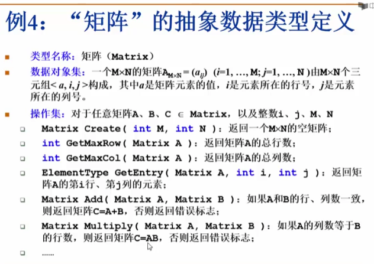
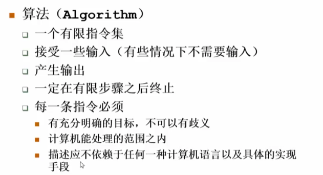
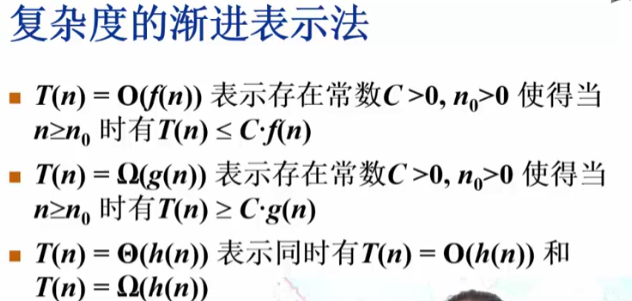
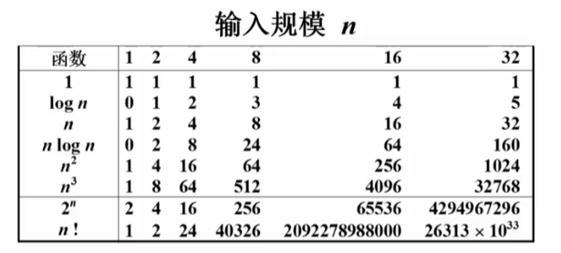
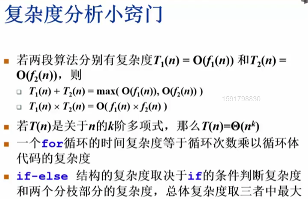

# 数据结构基础：算法复杂度分析

## 1.1 数据结构

摆放图书->任何操作要看他的数据规模

二分查找 O(logn) 但是插入比较困难

### 例2：打印PrintN

#### 1.递归方法
```cpp
// 递归很占用空间**** 1e5数据量就会爆
void PrintN(int N)
{
    if(N)
    {
        PrintN(N-1);
        printf("%d ",N);
    }
}
```

#### 2.普通方法
```cpp
for(int i = 1; i <= n; i++) {
    printf("%d ", i);
}
```

### 例3：多项式计算

#### 方法1：朴素算法
```cpp
double f1(int n, double a[], double x)
{
    double sum = 0;
    for(int i = 0; i <= n; i++)
    {
        sum += a[i] * pow(x, i);
    }
    return sum;
}
```

#### 方法2：秦九韶算法（霍纳法则）
```cpp
double f2(int n, double a[], double x)
{
    double p = a[n];
    for(int i = n; i > 0; i--)
    {
        p = a[i-1] + x * p;
    }
    return p;
}
```

### 数据类型的概念

- **数据类型**
  - 数据对象集
  - 数据集合相关联的操作集

- **抽象**：描述数据类型的方法不依赖于具体实现
  - 与存放数据的机器无关
  - 与数据存储的物理结构无关
  - 与实现操作的算法和编程语言均无关

只描述数据对象集和相关操作集"是什么"，并不涉及"如何做到"的问题

### 例4："矩阵"的抽象数据类型定义



这里矩阵就像一个对象，操作集就像（java中的方法）的集合

### 总结：
- 任何操作要看他的数据规模
- 抽象 
  - 在矩阵对象中：用什么方式存储并不关心
  - 在矩阵方法中：(以加方法为例)按行加按列加还是用什么语言算都不管

## 1.2 算法



抽象的伪代码描述

什么算法好？用时间复杂度T(n)和空间复杂度S(n)衡量

要关注最坏情况复杂度和平均复杂度

$$T_{\text{avg}}(n) \leq T_{\text{worst}}(n)$$

### 算法分析

递归要占用大量空间，系统一直要保存当前状态，去递归，等执行完这一状态再进行下一状态。如上文PrintN递归函数要先执行PrintN(N-1)才能执行printf。

如上文的计算多项式：
- f1要用 (n² + n) / 2 次乘法
- f2只需要 n 次乘法

时间复杂度对比：
- f1: $$T(n) = C_1n^2 + C_2n$$
- f2: $$T(n) = C \cdot n$$

## 复杂度的渐进表示法



注释：在这里f(n)就是上界，g(n)就是下界



### 规模示例


