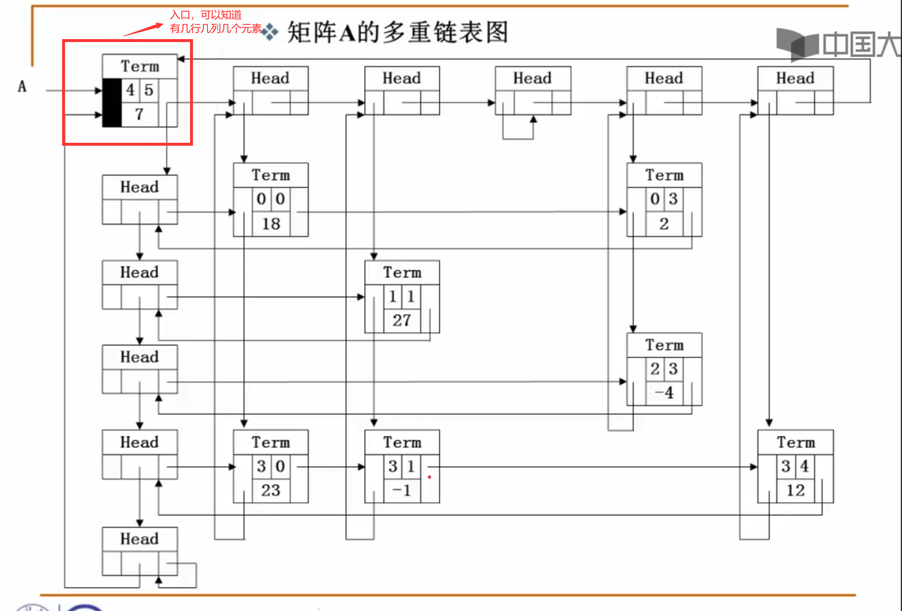

# 第2节 线性结构

## 2.1 线性表基础

### 多项式存储的三种方法

**例：存储多项式**

1. **单数组直接存储**：下标当指数x^i，a[i]当系数，但会导致资源浪费
2. **结构数组存储**：{系数,指数} 存储，降低资源浪费，多项式相加可以按指数从大到小存储
3. **链表存储**

### 线性表的定义

**"线性表(Linear List)"**：由同类型数据元素构成有序序列的线性结构

- 表中元素个数称为线性表的 **长度**
- 线性表没有元素时，称为 **空表**
- 表起始位置称 **表头**，表结束位置称 **表尾**

### 线性表的抽象数据类型描述

- **类型名称**：线性表（List）
- **数据对象集**：线性表是 $n (\geq 0)$ 个元素构成的有序序列 $(a_1, a_2, \ldots, a_n)$
- **操作集**：线性表 $L \in \text{List}$，整数 $i$ 表示位置，元素 $X \in \text{ElementType}$，线性表基本操作主要有：
  1. **List MakeEmpty()**：初始化一个空线性表 $L$；
  2. **ElementType FindKth( int K, List L )**：根据位序 $K$，返回相应元素；
  3. **int Find( ElementType X, List L )**：在线性表 $L$ 中查找 $X$ 的第一次出现位置；
  4. **void Insert( ElementType X, int i, List L )**：在位序 $i$ 前插入一个新元素 $X$；
  5. **void Delete( int i, List L )**：删除指定位序 $i$ 的元素；
  6. **int Length( List L )**：返回线性表 $L$ 的长度 $n$。

## 线性表的存储实现

### 1. 数组存储

```c
#include <stdio.h>
#include <malloc.h>

typedef struct Lnode* List;
struct Lnode
{
    int data[1000];
    int end;
};

struct Lnode L;

List Create()
{
    List ptr = (List)malloc(sizeof(Lnode));
    if(ptr==NULL) {
        printf("Failed");
        return NULL;
    }
    ptr->end = -1;
    return ptr;
}

int FindL(int x, List ptrl)
{
    int cnt = 0;
    while(cnt <= ptrl->end && ptrl->data[cnt] != x)
        cnt++;
    if(cnt > ptrl->end) return -1;
    else return cnt;
}

void InsertL(int ii, int x, List ptrl) // O(n)
{
    // 插入下标ii-1
    if(ptrl->end == 999) {
        printf("满了");
        return;
    }
    if(ii < 1 || ii > ptrl->end + 2) {
        printf("不合法的插入");
        return;
    }
    for(int i = ptrl->end + 1; i >= ii; i--)
    {
        ptrl->data[i] = ptrl->data[i-1];
    }
    ptrl->data[ii-1] = x;
    ptrl->end += 1;
}

void DeleteL(int ii, List ptrl) // O(n)
{
    if(ii < 1 || ii > ptrl->end + 1) {
        printf("删除不合法");
        return;
    }
    for(int i = ii - 1; i < ptrl->end; i++)
    {
        ptrl->data[i] = ptrl->data[i+1];
    }
    ptrl->end--;
}

void PrintL(List ptrl)
{
    for(int i = 0; i <= ptrl->end; i++)
        printf("%d ", ptrl->data[i]);
}

int main()
{
    List PTRL = Create();
    InsertL(1, 1, PTRL);
    InsertL(2, 3, PTRL);
    InsertL(3, 2, PTRL);
    DeleteL(1, PTRL);
    printf("%d\n", FindL(2, PTRL));
    PrintL(PTRL);
    return 0;
}
```

### 2. 链表存储

```c
#include <stdio.h>
#include <malloc.h>

typedef struct Lnode* List;
struct Lnode
{
    int data;
    List next;
};

int Length(List s)
{
    int cnt = 0;
    List ptr = s;
    while(ptr != NULL)
    {
        ptr = ptr->next;
        cnt++; // 加head不加尾总长相同
    }
    return cnt;
}

List FindKth(int K, List ptr)
{
    List tmp = ptr;
    int cnt = 1;
    while(tmp != NULL && cnt < K)
    {
        tmp = tmp->next;
        cnt++;
    }
    if(cnt == K) return tmp;
    else return NULL;
}

List Find(int x, List tmp) // 按内容寻找
{
    List ptr = tmp;
    /*
    while(ptr && ptr->data != x)
    {
        ptr = ptr->next;
    }
    return ptr; 
    */
    // 老师写法 下文其实差别不大
    while(ptr)
    {
        if(ptr->data == x) return ptr;
        ptr = ptr->next;
    }
    return NULL;
}

List Insert(int i, int x, List ptr) // 在第i-1个后面插入一个值
{
    if(i == 1) {
        List s = (List)malloc(sizeof(struct Lnode));
        s->data = x;
        s->next = ptr;
        return s;
    }
    List tmp = FindKth(i-1, ptr);
    if(tmp == NULL) {
        printf("找不到i");
        return ptr;
    }
    List ins = (List)malloc(sizeof(struct Lnode));
    ins->data = x;
    ins->next = tmp->next;
    tmp->next = ins;
    // 注意前两语句不能调换
    return ptr;
}

List Delete(int i, List ptr) // 删除第i个节点
{
    // if(i<1||i>Length(ptr)) {printf("这个节点不存在");return ptr;}
    if(i == 1) {
        if(ptr == NULL) return ptr;
        List tmp = ptr;
        ptr = tmp->next;
        free(tmp);
        return ptr;
    }
    List tmp = FindKth(i-1, ptr);
    if(tmp == NULL || tmp->next == NULL) {
        printf("反正找不到");
        return ptr;
    }
    List tmp2 = tmp->next;
    tmp->next = tmp2->next;
    free(tmp2);
    return ptr;
}

void PrintL(List s)
{
    List ptr = s;
    while(ptr != NULL)
    {
        printf("%d ", ptr->data);
        ptr = ptr->next;
    }
    printf("||\n");
}

int main()
{
    List ptr = (List)malloc(sizeof(struct Lnode));
    ptr->data = 0;
    ptr->next = NULL;
    ptr = Insert(2, 1, ptr);
    ptr = Insert(1, 3, ptr);
    printf("长度%d\n", Length(ptr));
    PrintL(ptr); // 3 0 1 ||
    ptr = Delete(1, ptr);
    printf("长度%d\n", Length(ptr));
    PrintL(ptr);
    return 0;
}
```

### 讨论2.1 链式存储中FindKth函数的另一种实现

如果将链式存储中FindKth的函数实现（如下）做个修改：把函数最后的if语句判断条件改为判断p是否为NULL，即：

```c
if (p==NULL) return NULL;
else return p;
```

或者说直接简化为：`return p;`

对于这样的修改，程序还正确吗？为什么？

```c
List FindKth( int K, List PtrL )
{
    List p = PtrL;
    int i = 1;
    while (p != NULL && i < K ){
        p = p->Next;
        i++;
    }
    if(i == K) return p;   /* 找到第K个，返回指针 */
    else return NULL;      /* 否则返回空 */
}
```

**注意！** 这里不太对，因为 k<1 会return head; 应该加上判断 `if(k<1) return NULL;`

## 矩阵的存储

矩阵可以用二维数组表示，但是二维数组有两个问题：
1. 数组大小需要先确定
2. 如果矩阵有很多0会导致资源浪费

所以可以用**十字链表**来存储稀疏矩阵

### 十字链表分析

采用一种典型的多重链表——十字链表来存储稀疏矩阵

- **只存储矩阵非0元素项**
  - 结点的数据域：行坐标Row、列坐标Col、数值Value
- **每个结点通过两个指针域，把同行、同列串起来**
  - 行指针（或称为向右指针）Right
  - 列指针（或称为向下指针）Down



## 总结

1. **数组存储**：随机访问快，但插入删除操作需要移动大量元素，时间复杂度O(n)
2. **链表存储**：插入删除方便，但查找需要遍历，不支持随机访问
3. **十字链表**：适用于稀疏矩阵存储，节省空间并保持矩阵结构
