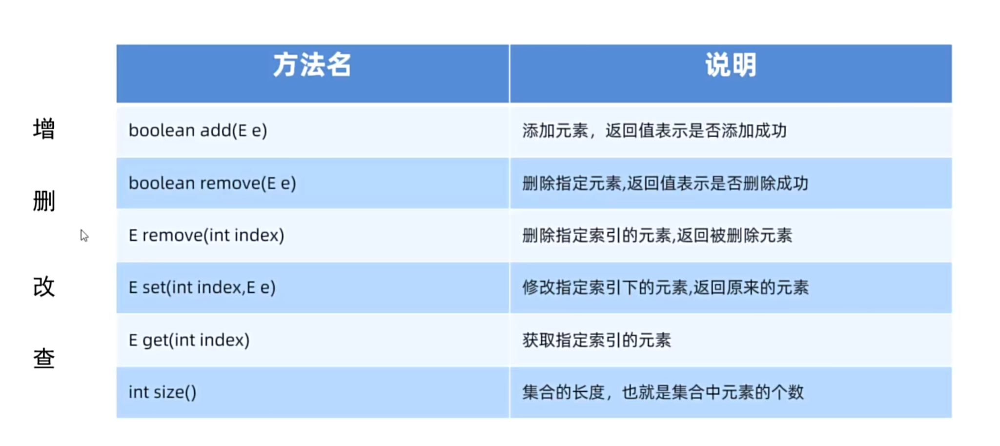

# Java ArrayList 学习笔记

## ArrayList 基础操作

### 基本使用示例

```java
package arraylist;

import java.util.ArrayList;

public class array1 {
    public static void main(String []args)
    {
        int a = 3;
        int []b= new int[3];
        int []c = b;
        b[0] = 1;
        System.out.println(b[0]);
        System.out.println(c[0]);
        
        // ArrayList<int> list = new ArrayList(); 不能写基本数据类型
        ArrayList<String> list = new ArrayList<String>(); // 后面<String>可省略
        list.add("fff");
        list.add("eee");
        System.out.println(list); // [fff,eee]
        
        list.remove("fff"); // 既可以匹配删除
        System.out.println(list); // [eee]
        
        list.remove(0); // 也可以按下标删除
        System.out.println(list); // []
        list.add(2,"aaa") // 在下标2后面加一个元素

        list.add("aaa"); // boolean 类型函数 成功 返回true
        System.out.println(list); // [aaa]
        
        String d = list.get(0); // aaa
        System.out.println(list.size()); // 1
        
        list.set(0,"bbb");//修改
        System.out.println(list); // [bbb]
    }
}
```



## 实战练习

### 作业1：插入学生对象并遍历

#### Student 类
```java
package arraylist;

public class Student {
    private String name;
    private int age;

    public Student() {
    }

    public Student(String name, int age) {
        this.name = name;
        this.age = age;
    }

    /**
     * 获取
     * @return name
     */
    public String getName() {
        return name;
    }

    /**
     * 设置
     * @param name
     */
    public void setName(String name) {
        this.name = name;
    }

    /**
     * 获取
     * @return age
     */
    public int getAge() {
        return age;
    }

    /**
     * 设置
     * @param age
     */
    public void setAge(int age) {
        this.age = age;
    }

    public String toString() {
        return "Student{name = " + name + ", age = " + age + "}";
    }
}
```

#### 插入遍历主函数
```java
package arraylist;

import java.util.ArrayList;
import java.util.Scanner;

public class array2 {
    public static void main(String[] args)
    {
        ArrayList<Student> a = new ArrayList<>();
        System.out.println(a); // 只需要在Student 类里面重写toString方法就可以
        // [Student{name = zhangsan, age = 14}, Student{name = lisi, age = 14}]
        // a的初始size为0
        Scanner sc = new Scanner(System.in);
        for(int i = 0; i < 3; i++)
        {
            String f = sc.next();
            int ff = sc.nextInt();
            a.add(new Student(f, ff));
        } // 插入三个对象
        System.out.println(a);
    }
}
```

### 作业2：遍历查找用户是否存在

#### Player 类
```java
package arraylist;

public class Player {
    private String id;
    private String name;
    private String password;

    public Player() {
    }

    public Player(String id, String name, String password) {
        this.id = id;
        this.name = name;
        this.password = password;
    }

    /**
     * 获取
     * @return id
     */
    public String getId() {
        return id;
    }

    /**
     * 设置
     * @param id
     */
    public void setId(String id) {
        this.id = id;
    }

    /**
     * 获取
     * @return name
     */
    public String getName() {
        return name;
    }

    /**
     * 设置
     * @param name
     */
    public void setName(String name) {
        this.name = name;
    }

    /**
     * 获取
     * @return password
     */
    public String getPassword() {
        return password;
    }

    /**
     * 设置
     * @param password
     */
    public void setPassword(String password) {
        this.password = password;
    }

    public String toString() {
        return "Player{id = " + id + ", name = " + name + ", password = " + password + "}";
    }
}
```

#### 主函数
```java
package arraylist;

import java.util.ArrayList;
import java.util.Scanner;

public class arrayhw2 {
    public static void main(String[]args)
    {
        ArrayList<Player> e = new ArrayList<>();
        e.add(new Player("111","zhangsan","password"));
        e.add(new Player("112","zhangsan","password"));
        e.add(new Player("113","zhangsan","password"));
        Scanner sc = new Scanner(System.in);
        String find = sc.next();
        System.out.println(Find(find,e));
    }
    
    public static boolean Find(String find,ArrayList<Player> s)
    {
        for (Player player : s) {
            if(find.equals(player.getId())) {
                return true;
            }
        }
        return false;
    }
}
```

### 作业3：返回多个数据

设置一个手机，返回一些手机价格小于3000的手机

#### 手机类
```java
package arraylist;

public class Phone {
   private String Brand;
   private int price;

    public Phone() {
    }

    public Phone(String Brand, int price) {
        this.Brand = Brand;
        this.price = price;
    }

    /**
     * 获取
     * @return Brand
     */
    public String getBrand() {
        return Brand;
    }

    /**
     * 设置
     * @param Brand
     */
    public void setBrand(String Brand) {
        this.Brand = Brand;
    }

    /**
     * 获取
     * @return price
     */
    public int getPrice() {
        return price;
    }

    /**
     * 设置
     * @param price
     */
    public void setPrice(int price) {
        this.price = price;
    }

    public String toString() {
        return "{牌子" + Brand + ",价格=" + price + "}";
    }
}
```

#### 主函数
```java
package arraylist;

import java.util.ArrayList;

public class arrayhw3 {
    public static void main(String []args)
    {
        ArrayList<Phone> e = new ArrayList<>();
        e.add(new Phone("小米",1000));
        e.add(new Phone("苹果",8000));
        e.add(new Phone("锤子",2999));
        ArrayList<Phone> ans = Find(3000,e);
        System.out.println(ans);
    }
    
    public static ArrayList<Phone> Find(int price,ArrayList<Phone> f)
    {
        ArrayList<Phone> rt = new ArrayList<>();
        for (Phone phone : f) {
            if(phone.getPrice() < price) {
                rt.add(phone);
            }
        }
        return rt;
    }
}
```

## 学习总结

### ArrayList 的特点
1. **泛型集合**：不能存储基本数据类型，需要使用包装类
2. **动态数组**：大小可以动态调整
3. **有序集合**：元素按照插入顺序排列
4. **允许重复**：可以存储重复元素

### 常用方法
- `add()`：添加元素
- `remove()`：删除元素（按值或索引）
- `get()`：获取元素
- `set()`：修改元素
- `size()`：获取集合大小
- `toString()`：输出集合内容

### 注意事项
1. 自定义类需要重写 `toString()` 方法才能正确打印
2. 使用增强for循环遍历更简洁
3. 删除元素时注意索引变化
4. 字符串比较使用 `equals()` 方法

