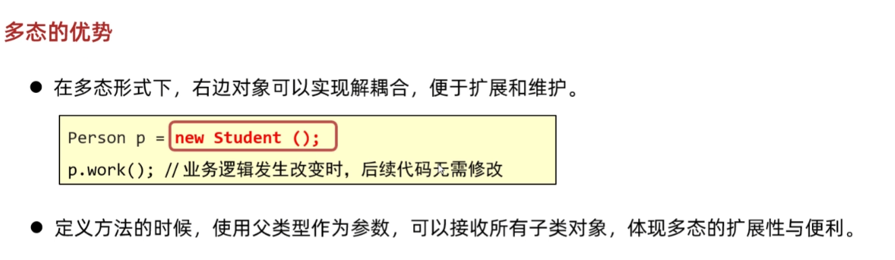

# Java面向对象进阶笔记（二）：多态

## 1. 多态基础

多态的前提之一是继承。  
如：一个 `person` 基类有三个子类 `teacher`、`student`、`admin`。  
注册对象时可以重载注册函数，但这样冗余。更优雅的做法：

```java
public void register(person p) {
    // 根据传递类型不同调用方法
    p.show();
}
```

- **调用成员变量**：编译看左边，运行也看左边
- **调用成员方法**：编译看左边，运行看右边

> 编译看左边：javac编译代码时，会看左边的父类中有没有这个方法，有则编译成功，否则失败。  
> 运行看右边：java运行代码时，实际运行的是子类中的方法。

```java
a.show(); // Dog --- show方法
```

理解：
```java
Animal a = new Dog();
// 用a去调用变量和方法，a是Animal类型，默认从Animal类中找
```
- 成员变量：子类对象会继承父类的成员变量（父：name 子：name）
- 成员方法：子类重写方法后，虚方法表会覆盖父类的方法

即：`person a = new teacher();`  
如果都有`show()`方法，a调用时会执行teacher中的show，但变量都继承而不是覆盖。

---

## 2. 多态的优势与弊端

### 2.1 优势

- 代码扩展性强，统一接口
- 例如：
  ```java
  ArrayList list = new ArrayList();
  list.add(Object a); // 可以插入任意类
  ```
- 

### 2.2 弊端

1. **不能直接调用子类特有方法**

   ```java
   Animal a = new Dog();
   // a.lookhome(); // 错误，Animal没有lookhome方法

   // 需要强制类型转换
   if(a instanceof Dog) {
       Dog d = (Dog)a;
       d.lookhome();
   } else if(a instanceof Cat) {
       Cat c = (Cat)a;
       c.catchmouse();
   } else {
       System.out.println("没有此类型");
   }
   ```

   - Java14新特性：`if(a instanceof Dog d)` 判断并强转，能转则转换并d指向它

2. **类型转换**

   - 自动类型转换：`Animal a = new Dog();`
   - 强制类型转换：`Dog c = (Dog)a;`
   - 强转后可用子类独有功能，但需判断类型一致性（用`instanceof`）

---

## 3. 多态实战代码

### 3.1 例题代码

#### Animal类

```java
package ToObjectAdvanced.Polymorphism.P1;

public class Animal {
    private int age;
    private String color;

    public Animal() {}
    public Animal(int age, String color) {
        this.age = age;
        this.color = color;
    }

    public String eat(String something) {
        if(something.equals("骨头")) return "两只前腿死死的抱住骨头猛吃";
        else if(something.equals("鱼")) return "眯着眼睛侧着头吃鱼";
        else return something;
    }

    public int getAge() { return age; }
    public void setAge(int age) { this.age = age; }
    public String getColor() { return color; }
    public void setColor(String color) { this.color = color; }
    public String wtiam() { return "动物"; }
    public String toString() { return "1"; }
}
```

#### Dog类

```java
package ToObjectAdvanced.Polymorphism.P1;

public class Dog extends Animal {
    public Dog(int a, String c) { super(a, c); }
    public String toString() { return getAge() + "岁的" + getColor() + "颜色的狗"; }
    public String wtiam() { return "狗"; }
    public void lookhome() {}
}
```

#### Cat类

```java
package ToObjectAdvanced.Polymorphism.P1;

public class Cat extends Animal {
    public Cat(int a, String c) { super(a, c); }
    public String toString() { return getAge() + "岁的" + getColor() + "颜色的猫"; }
    public String wtiam() { return "猫"; }
    public void catchMouse() {}
}
```

#### Person类

```java
package ToObjectAdvanced.Polymorphism.P1;

public class Person {
    private String name;
    private int age;

    public Person() {}
    public Person(String name, int age) {
        this.name = name;
        this.age = age;
    }

    public void keepPet(Animal animal, String something) {
        System.out.println(this + "养了一只" + animal.getColor() + "颜色的" + animal.getAge() + "岁的" + animal.wtiam());
        System.out.println(animal + animal.eat(something));
    }

    public String getName() { return name; }
    public void setName(String name) { this.name = name; }
    public int getAge() { return age; }
    public void setAge(int age) { this.age = age; }
    public String toString() { return "年龄为" + age + "岁的" + name; }
}
```

#### Main入口

```java
package ToObjectAdvanced.Polymorphism.P1;

public class Main {
    public static void main(String[] args) {
        Animal a = new Dog(2, "黑");
        Animal b = new Cat(3, "灰");
        Person c = new Person("老王", 30);
        Person d = new Person("老李", 25);
        c.keepPet(a, "骨头");
        d.keepPet(b, "鱼");
    }
}
```

---

## 4. 思考

1. 多态的本质与优势
2. `instanceof` 判断与强制类型转换的安全用法

---
*最后更新：2025年7月8日*
        System.out.println(animal + animal.eat(something));
    }

    /**
     * 获取
     * @return name
     */
    public String getName() {
        return name;
    }

    /**
     * 设置
     * @param name
     */
    public void setName(String name) {
        this.name = name;
    }

    /**
     * 获取
     * @return age
     */
    public int getAge() {
        return age;
    }

    /**
     * 设置
     * @param age
     */
    public void setAge(int age) {
        this.age = age;
    }

    public String toString() {
        return "年龄为"+ age + "岁的" + name;
    }
}
//Main入口
package ToObjectAdvanced.Polymorphism.P1;

public class Main {
    public static  void main(String [] args)
    {
        Animal a = new Dog(2,"黑");
        Animal b = new Cat(3,"灰");
        Person c = new Person("老王",30);
        Person d = new Person("老李",25);
        c.keepPet(a,"骨头");
        d.keepPet(b,"鱼");
    }
}
思考：
1.多态 2.instanceof 强转 

