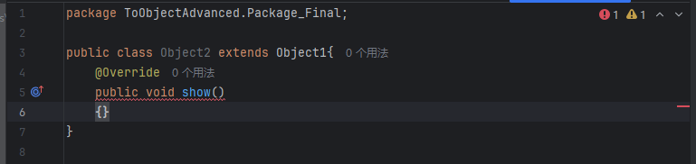
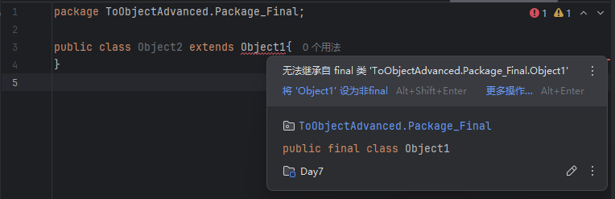

# Java 包与 final 关键字笔记

> 最后更新：2025年7月8日

## 1. 包（package）

### 1.1 基本用法

默认情况下，使用其它类需要使用全类名：

```java
public class Test {
    public static void main(String[] args) {
        com.itheima.domain.Student s = new com.itheima.domain.Student();
    }
}
```

可以使用 `import` 导包简化：

```java
import com.itheima.domain.Student;

public class Test {
    public static void main(String[] args) {
        Student s = new Student();
    }
}
```

### 1.2 导包演示

```java
package ToObjectAdvanced.Package_Final;

import ToObjectAdvanced.Extends.Student;

public class Package_and_Final {
    public static void main(String [] args) {
        Student a = new Student();
    }
}
```

### 1.3 同名类的全类名用法

如果同时使用两个包中的同名类，需要用全类名：

```java
package ToObjectAdvanced.Package_Final;
public class Package_and_Final {
    public static void main(String [] args) {
        ToObjectAdvanced.Static.Student a = new ToObjectAdvanced.Static.Student();
        ToObjectAdvanced.Extends.Student b = new ToObjectAdvanced.Extends.Student();
    }
}
```
此时不能import，否则会报错。

### 1.4 总结

1. **包的作用？**  
   包就是文件夹，用来管理各种不同功能的 Java 类。

2. **包名书写的规则？**  
   公司域名反写 + 包的作用，需要全部英文小写，见名知意。

3. **什么是全类名？**  
   包名 + 类名。

4. **什么时候需要导包？什么时候不需要导包？**  
   - 使用同一个包中的类时，不需要导包。
   - 使用 `java.lang` 包中的类时，不需要导包。
   - 其他情况都需要导包。
   - 如果同时使用两个包中的同名类，需要用全类名。

---

## 2. final 关键字

### 2.1 final修饰方法

| final修饰方法 | 表明该方法是最终方法，不能被重写 |

**示例：**

```java
package ToObjectAdvanced.Package_Final;

public class Object1 {
    public Object1() {}
    public final void show() {
        System.out.println("SHOW WHAT");
    }
}
```

再创建一个类Object2继承Object1，尝试覆写show()方法会报错。  


---

### 2.2 final修饰类

| final修饰类 | 表明该类是最终类，不能被继承 |

**示例：**

```java
package ToObjectAdvanced.Package_Final;

public final class Object1 {
    public Object1() {}
}
```

再创建一个Object2尝试继承Object1会报错。  


---

### 2.3 final修饰变量

| final修饰变量 | 叫做常量，只能被赋值一次 |

类似 C/C++ 的 const 常量：

```java
final int a = 10;
```

final修饰引用数据类型，记录的地址不能发生改变，但内部属性可以变：

```java
final Student S = new Student("zhangsan",14);
// 报错:
S = new Student();
// 合法操作:
S.setName("lisi");
```
