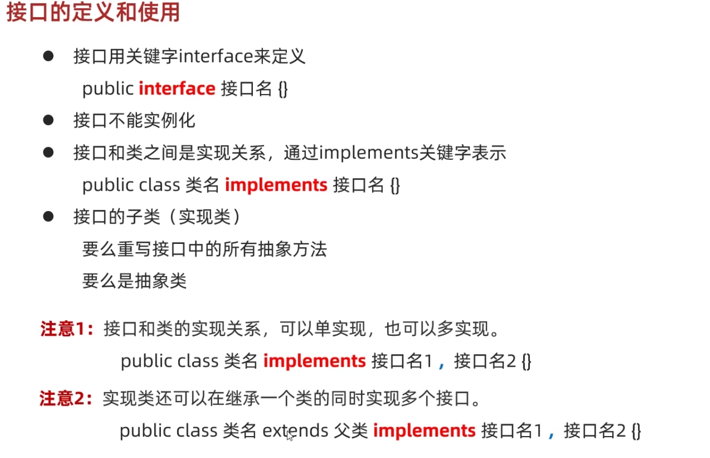
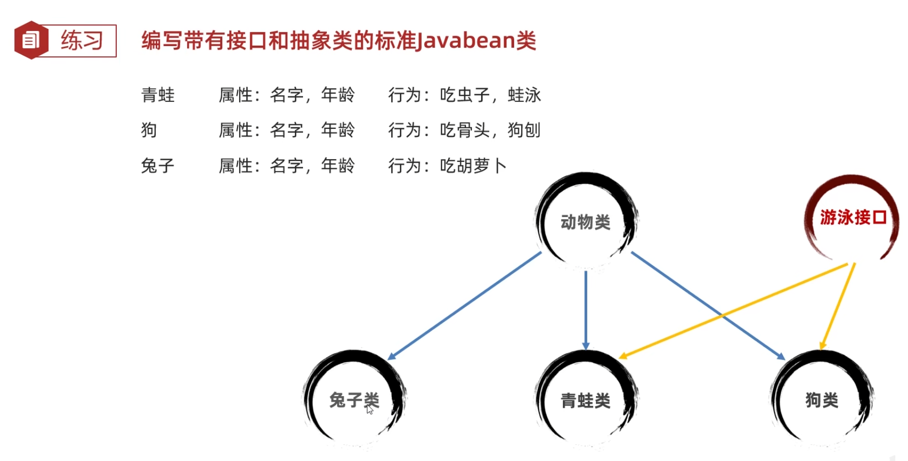

# Java 接口 笔记

> 日期：2025-07-10

## 目录

- [接口的基本概念](#接口的基本概念)
- [接口实现案例](#接口实现案例)
- [接口成员的特点](#接口成员的特点)
- [接口与类/接口的关系](#接口与类接口的关系)
- [接口与抽象类综合案例](#接口与抽象类综合案例)
- [接口新特性（JDK8/9）](#接口新特性jdk89)
- [适配器设计模式](#适配器设计模式)
- [总结](#总结)

---

## 接口的基本概念

- 接口是一种规则，是对行为的抽象。
- 当需要给多个类同时定义规则时，使用接口。

> 

---

## 接口实现案例

### 例1

> 

**Animal类：**

```java
package Interface;

public abstract class Animal {
    private String name;
    private int age;

    public Animal() {
    }

    public Animal(String name, int age) {
        this.name = name;
        this.age = age;
    }

    /**
     * 获取
     * @return name
     */
    public String getName() {
        return name;
    }

    /**
     * 设置
     * @param name
     */
    public void setName(String name) {
        this.name = name;
    }

    /**
     * 获取
     * @return age
     */
    public int getAge() {
        return age;
    }

    /**
     * 设置
     * @param age
     */
    public void setAge(int age) {
        this.age = age;
    }

    public String toString() {
        return "Animal{name = " + name + ", age = " + age + "}";
    }
    public abstract void eat();
}
```

**Frog类：**

```java
package Interface;

public class Frog extends Animal implements Swim {
    @Override
    public void eat() { System.out.println("吃虫子"); }

    public Frog() {
    }

    public Frog(String name, int age) {
        super(name, age);
    }

    @Override
    public void swim() { System.out.println("我会蛙泳"); }
}
```

**Dog类：**

```java
package Interface;

public class Dog extends Animal implements Swim {
    @Override
    public void eat() { System.out.println("吃骨头"); }

    public Dog() {
    }

    public Dog(String name, int age) {
        super(name, age);
    }

    @Override
    public void swim() { System.out.println("我会狗刨"); }
}
```

**Rabbit类：**

```java
package Interface;

public class Rabbit extends Animal {
    @Override
    public void eat() { System.out.println("吃胡萝卜"); }

    public Rabbit() {
    }

    public Rabbit(String name, int age) {
        super(name, age);
    }
}
```

**Swim接口：**

```java
package Interface;

public interface Swim {
    public abstract void swim();
}
```

**Test类：**

```java
package Interface;

public class Test {
    public static void main(String[] args) {
        Frog a = new Frog("96",14);
        System.out.println(a);
        a.eat();
        a.swim();
        Dog b = new Dog("旺财",14);
        System.out.println(b);
        b.eat();
        b.swim();
        Rabbit c = new Rabbit("土",14);
        System.out.println(c);
        c.eat();
    }
}
```

---

## 接口成员的特点

- **成员变量**：只能是常量，默认 `public static final`
- **构造方法**：没有
- **成员方法**：只能是抽象方法，默认 `public abstract`
- **JDK7以前**：接口中只能定义抽象方法

---

## 接口与类/接口的关系

- **类和类**：继承关系，只能单继承，可以多层继承
- **类和接口**：实现关系，可以单实现、多实现，也可以继承一个类的同时实现多个接口
- **接口和接口**：继承关系，可以单继承、多继承

类实现子接口意味着要重写该接口的所有方法。

---

## 接口与抽象类综合案例

### 案例描述

- 乒乓球运动员：姓名，年龄，学打乒乓球，说英语
- 篮球运动员：姓名，年龄，学打篮球
- 乒乓球教练：姓名，年龄，教打乒乓球，说英语
- 篮球教练：姓名，年龄，教打篮球

### 结构设计

**Person类（抽象）：**

```java
package Interface.P1;

public abstract class Person {
    private String name;
    private int age;

    public Person() {
    }

    public Person(String name, int age) {
        this.name = name;
        this.age = age;
    }

    /**
     * 获取
     * @return name
     */
    public String getName() {
        return name;
    }

    /**
     * 设置
     * @param name
     */
    public void setName(String name) {
        this.name = name;
    }

    /**
     * 获取
     * @return age
     */
    public int getAge() {
        return age;
    }

    /**
     * 设置
     * @param age
     */
    public void setAge(int age) {
        this.age = age;
    }

    public String toString() {
        return "Person{name = " + name + ", age = " + age + "}";
    }
}
```

**Player/Coach类（抽象）：**

```java
package Interface.P1;

public abstract class Player extends Person {
    public abstract void Learning();

    public Player() {
    }

    public Player(String name, int age) {
        super(name, age);
    }
}

public abstract class Coach extends Person {
    public abstract void Teaching();

    public Coach() {
    }

    public Coach(String name, int age) {
        super(name, age);
    }
}
```

**四个具体类：**

```java
package Interface.P1;

public class PingPongPlayer extends Player implements SpeakEnglish {
    @Override
    public void Learning() { System.out.println("学习打乒乓球"); }
    @Override
    public void speakEnglish() { System.out.println("说英语"); }

    public PingPongPlayer() {
    }

    public PingPongPlayer(String name, int age) {
        super(name, age);
    }
}

public class PingPongCoach extends Coach implements SpeakEnglish {
    @Override
    public void Teaching() { System.out.println("教打乒乓球"); }
    @Override
    public void speakEnglish() { System.out.println("说英语"); }

    public PingPongCoach() {
    }

    public PingPongCoach(String name, int age) {
        super(name, age);
    }
}

public class BasketballCoach extends Coach {
    @Override
    public void Teaching() { System.out.println("教打篮球"); }

    public BasketballCoach() {
    }

    public BasketballCoach(String name, int age) {
        super(name, age);
    }
}

public class BasketballPlayer extends Player {
    @Override
    public void Learning() { System.out.println("学习打篮球"); }

    public BasketballPlayer() {
    }

    public BasketballPlayer(String name, int age) {
        super(name, age);
    }
}
```

**SpeakEnglish接口：**

```java
package Interface.P1;

public interface SpeakEnglish {
    public void speakEnglish();
}
```

---

## 接口新特性（JDK8/9）

### JDK8

- 可定义有方法体的默认方法  
  `public default 返回值类型 方法名(参数列表) { }`
- 默认方法不是抽象方法，不强制重写。重写时去掉 `default`。
- 多接口有同名默认方法，子类必须重写。
- 可定义静态方法  
  `public static 返回值类型 方法名(参数列表) { }`
- 静态方法只能通过接口名调用，不能被重写。

### JDK9

- 允许定义接口中的私有方法，只能在接口内部使用

```java
public interface InterA {
    /*public default void show3()
    {
sout("only");
    }*/
    //上文用于java8
    private void show3()
    {
        sout("only");
    }//java9+
    public default void show1()
    {
        sout("...");
        show3();
        sout("...");
        sout("...");
    }
    public default void show2()
    {
        sout("...");
        show3();
        sout("...");
        sout("...");
    }
}
```

---

## 适配器设计模式

- 当一个接口中抽象方法过多，但只需用部分方法时，可用适配器设计模式。

**步骤：**
1. 编写中间类 `XXXAdapter`，实现接口
2. 对接口中的抽象方法进行空实现
3. 真正实现类继承中间类，并重写需要用的方法
4. 适配器类用 `abstract` 修饰，避免被直接实例化

---

## 总结

1. 接口代表规则，是行为的抽象。让类实现接口即可拥有该行为。
2. 方法参数为接口类型时，可传递接口所有实现类对象，称为接口多态。
3. 适配器模式适用于接口方法过多但只需部分实现的场景。
2. 当一个方法的参数是接口时，可以传递接口所有实现类的对象，这种方式称之为接口多态。
