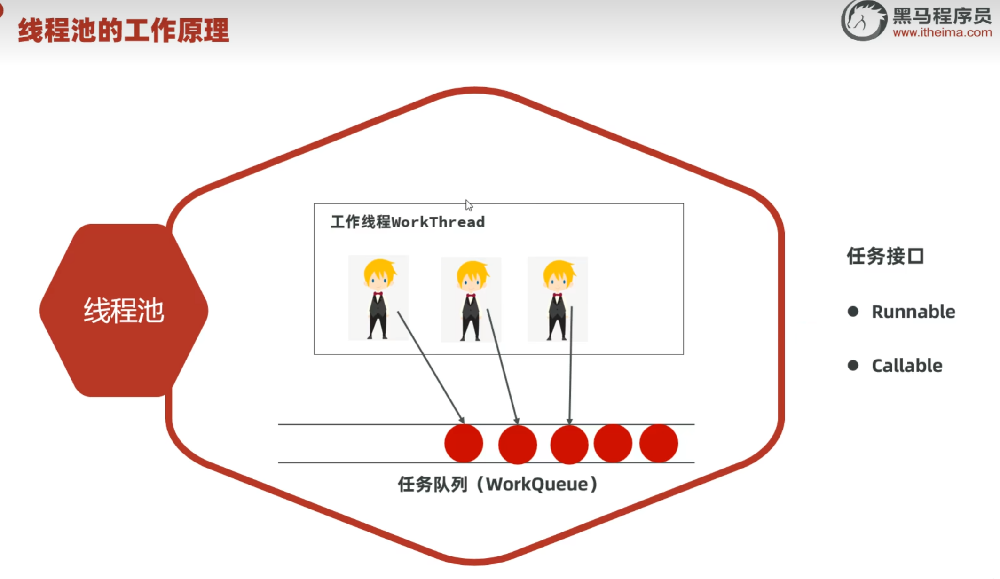

# Java 多线程 笔记

> 日期：2025-07-21

## 目录

- [多线程创建方式](#多线程创建方式)
- [Thread常用方法与构造器](#thread常用方法与构造器)
- [线程安全与同步](#线程安全与同步)
- [Lock锁机制](#lock锁机制)
- [线程池ExecutorService](#线程池executorservice)
- [线程池拒绝策略](#线程池拒绝策略)
- [总结](#总结)

---

## 多线程创建方式

### 方式一：继承Thread类

```java
class MyThread extends Thread {
    @Override
    public void run() {
        // 线程任务代码
    }
}
new MyThread().start(); // 启动新线程
```

- 优点：编码简单  
- 缺点：已继承Thread，无法再继承其他类，不利于扩展  

> 注意：必须调用`start()`才会创建新线程，直接调用`run()`只是普通方法调用。

### 方式二：实现Runnable接口

```java
class MyRunnable implements Runnable {
    @Override
    public void run() {
        // 线程任务代码
    }
}
new Thread(new MyRunnable()).start();
```

- 优点：可以继续继承其他类或实现其他接口，扩展性强  
- 缺点：需要额外的Runnable对象  

**Lambda简化：**

```java
new Thread(() -> {
    for (int i = 0; i < 100; i++) {
        System.out.println("Thread-Runnable-" + i);
    }
}).start();
```

### 方式三：实现Callable接口 + FutureTask

可以在线程执行完毕后获取结果。

```java
Callable<String> callable = new MyCallable(100);
FutureTask<String> task = new FutureTask<>(callable);
new Thread(task).start();
String result = task.get(); // 获取结果
```

**MyCallable示例：**

```java
class MyCallable implements Callable<String> {
    private int n;
    public MyCallable(int n) { this.n = n; }
    @Override
    public String call() {
        int sum = 0;
        for (int i = 1; i <= n; i++) {
            sum += i;
        }
        return String.valueOf(sum);
    }
}
```

- 优点：可扩展、可获取执行结果  
- 缺点：编码稍复杂  

---

## Thread常用方法与构造器

| 方法 | 说明 |
| --- | --- |
| `run()` | 线程的执行逻辑 |
| `start()` | 启动线程 |
| `getName()` | 获取线程名称 |
| `setName(String)` | 设置线程名称 |
| `currentThread()` | 获取当前执行线程 |
| `sleep(long)` | 睡眠指定毫秒 |
| `join()` | 等待该线程执行结束 |

| 构造器 | 说明 |
| --- | --- |
| `Thread(String name)` | 指定线程名称 |
| `Thread(Runnable target)` | 使用Runnable创建线程 |
| `Thread(Runnable target, String name)` | 指定Runnable和线程名称 |

---

## 线程安全与同步

### 同步代码块

使用`synchronized`保证同一时刻仅一个线程访问：

```java
public void drawMoney(double amount) {
    synchronized (this) {
        // 访问共享资源
    }
}
```

- 实例方法锁对象：`this`  
- 静态方法锁对象：`类名.class`  

### 同步方法

```java
public synchronized void drawMoney(double amount) {
    // 访问共享资源
}
```

---

## Lock锁机制

Lock接口提供更灵活的锁操作：

```java
package ThreadSecurity;
import lombok.AllArgsConstructor;
import lombok.Data;
import lombok.NoArgsConstructor;
import java.util.concurrent.locks.Lock;
import java.util.concurrent.locks.ReentrantLock;

@Data
@AllArgsConstructor
@NoArgsConstructor
public class Account {
    private double money;
    public final Lock lock = new ReentrantLock();
    
    public void DrawMoney(double x) {
        lock.lock();
        try {
            System.out.println(Thread.currentThread().getName() + " 正在取钱，取款金额为：" + x);
            if (x > money) {
                System.out.println(Thread.currentThread().getName() + " 取钱失败，余额不足");
            } else {
                money -= x;
                System.out.println(Thread.currentThread().getName() + " 取钱成功，余额为：" + money);
            }
        } finally {
            lock.unlock();
        }
    }
}
```

**Lock锁的优势：**
- 建议锁对象使用`final`修饰，防止被篡改
- 释放锁操作必须放在`finally`代码块中，确保锁一定会被释放

---

## 线程池ExecutorService

线程池是一种可以复用线程的技术，解决频繁创建线程的性能问题。

### 不使用线程池的问题
- 用户每发起一个请求，后台就需要创建一个新线程来处理
- 创建新线程的开销很大
- 请求过多时会产生大量线程，严重影响系统性能



### ThreadPoolExecutor构造器参数详解

| 参数 | 说明 | 比喻 |
| --- | --- | --- |
| `corePoolSize` | 核心线程数量 | 正式工：3人 |
| `maximumPoolSize` | 最大线程数量 | 最大员工数：5人 |
| `keepAliveTime` | 临时线程存活时间 | 临时工空闲多久被开除 |
| `unit` | 时间单位 | 秒、分、时、天 |
| `workQueue` | 任务队列 | 客人排队的地方 |
| `threadFactory` | 线程工厂 | 负责招聘员工的HR |
| `handler` | 任务拒绝策略 | 忙不过来怎么办 |

### ExecutorService常用方法

| 方法 | 说明 |
| --- | --- |
| `execute(Runnable command)` | 执行Runnable任务 |
| `submit(Callable<T> task)` | 执行Callable任务，返回Future对象 |
| `shutdown()` | 等全部任务执行完毕后关闭线程池 |
| `shutdownNow()` | 立即关闭线程池，返回未执行的任务 |

### 线程池执行流程

1. **什么时候创建临时线程？**
   - 核心线程都在忙，任务队列也满了，且还可以创建临时线程时

2. **什么时候拒绝新任务？**
   - 核心线程和临时线程都在忙，任务队列也满了时

---

## 线程池拒绝策略

| 策略 | 说明 |
| --- | --- |
| `ThreadPoolExecutor.AbortPolicy()` | 丢弃任务并抛出RejectedExecutionException异常（默认策略） |
| `ThreadPoolExecutor.DiscardPolicy()` | 丢弃任务但不抛异常（不推荐） |
| `ThreadPoolExecutor.DiscardOldestPolicy()` | 丢弃队列中等待最久的任务，加入当前任务 |
| `ThreadPoolExecutor.CallerRunsPolicy()` | 由主线程负责调用任务的run()方法 |

### 线程池使用示例

```java
package ThreadPool;
import java.util.concurrent.*;

public class Demo1 {
    public static void main(String[] args) {
        ExecutorService ex = new ThreadPoolExecutor(
            3, 5, 10, TimeUnit.SECONDS,
            new ArrayBlockingQueue<>(3),
            Executors.defaultThreadFactory(),
            new ThreadPoolExecutor.AbortPolicy()
        );
        
        Runnable r = new MyRunnable();
        // 线程池大小为3，最大为5，队列为3，超过8个任务就拒绝执行
        ex.execute(r); // 核心线程1
        ex.execute(r); // 核心线程2
        ex.execute(r); // 核心线程3
        ex.execute(r); // 进入队列1
        ex.execute(r); // 进入队列2
        ex.execute(r); // 进入队列3
        ex.execute(r); // 创建临时线程4
        ex.execute(r); // 创建临时线程5
        // ex.execute(r); // 队列满了，会被拒绝执行
        
        // ex.shutdown(); // 执行完关闭
        ex.shutdownNow(); // 立即关闭
    }
}
```

---

## 总结

1. **多线程创建**：Thread、Runnable、Callable+FutureTask
2. **线程安全**：同步代码块、同步方法、Lock锁
3. **线程池**：提高并发性能，需合理配置参数
4. **拒绝策略**：根据业务需求选择合适的拒绝策略
5. **最佳实践**：优先使用线程池，避免手动创建线程
- **参数五**：`workQueue`：指定线程池的任务队列。
  - 客人排队的地方
- **参数六**：`threadFactory`：指定线程池的线程工厂。
  - 负责招聘员工的（hr）
- **参数七**：`handler`：指定线程池的任务拒绝策略（线程都在忙，任务队列也满了的时候，新任务来了该怎么处理）
  - 忙不过来咋办？
