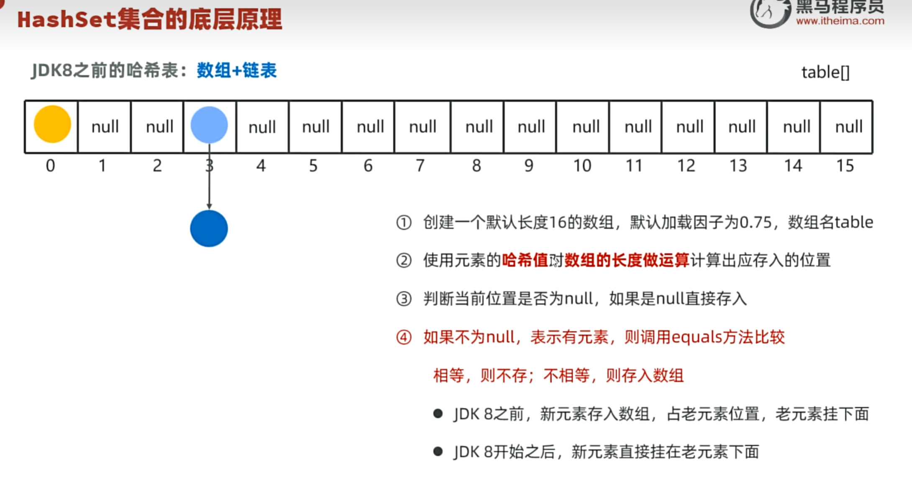
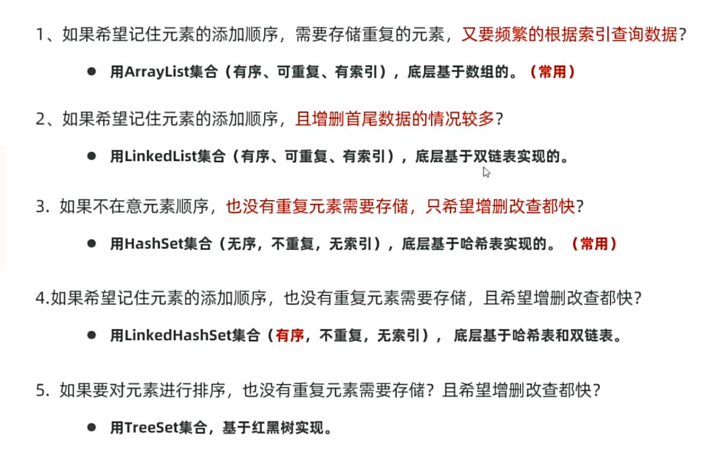

# Java 集合框架(二) Set 笔记

> 日期：2025-07-15

## 目录

- [Set集合特点](#set集合特点)
- [底层分析](#底层分析)
- [HashSet去重机制](#hashset去重机制)
- [LinkedHashSet底层原理](#linkedhashset底层原理)
- [TreeSet底层原理与排序](#treeset底层原理与排序)

---

## Set集合特点

Set系列集合特点：**无序**、**不重复**、**无索引**

- **HashSet**：无序、不重复、无索引
- **LinkedHashSet**：**有序**、不重复、无索引
- **TreeSet**：**排序**、不重复、无索引

### 示例对比

```java
// HashSet - 无序
Set<String> set = new HashSet<>();
// 输出：[python, c++, java, b人工智能, d新媒体, a鸿蒙]

// LinkedHashSet - 有序（保持插入顺序）
Set<String> set = new LinkedHashSet<>();
// 输出：[java, python, c++, a鸿蒙, b人工智能, d新媒体]

// TreeSet - 排序
Set<String> set = new TreeSet<>();
// 输出：[a鸿蒙, b人工智能, c++, d新媒体, java, python]

// 添加数据
set.add("java");
set.add("python");
set.add("c++");
set.add("java");     // 重复元素不会被添加
set.add("a鸿蒙");
set.add("b人工智能");
set.add("d新媒体");
System.out.println(set);
```

---

## 底层分析

### HashSet

基于哈希表存储数据。

#### 哈希值

- 哈希值是一个 `int` 类型的随机值，Java中每个对象都有一个哈希值
- 通过 `Object.hashCode()` 方法获取：`public int hashCode()`

#### 对象哈希值的特点

- 同一个对象多次调用 `hashCode()` 方法返回的哈希值相同
- 不同对象的哈希值大概率不相等，但也可能相等（哈希碰撞）

#### 哈希表

- **JDK8之前**：数组 + 链表
- **JDK8开始**：数组 + 链表 + 红黑树

特点：增删改查数据性能都较好的数据结构。



#### 扩容机制

- **JDK8之前**：当总数据量超过 `长度 × 加载因子` 就会扩容
- **JDK8之后**：当链表长度超过8，并且数组长度≥64时，自动将链表转换为红黑树

> 红黑树：可以自平衡的二叉树，左右树枝高度差为1

---

## HashSet去重机制

需要重写 `hashCode()` 和 `equals()` 方法来避免重复数据。

### 示例代码

```java
package Collection.Set.HashSet;
import java.util.HashSet;

public class Hashdemo {
    public static void main(String[] args) {
        HashSet<Student> set = new HashSet<>();
        set.add(new Student(18, "张三", "北京", "1234567890"));
        set.add(new Student(20, "李四", "上海", "0987654321"));
        set.add(new Student(20, "李四", "上海", "0987654321")); // 重复数据
        set.add(new Student(22, "王五", "广州", "1122334455"));
        set.add(new Student(18, "张三", "北京", "1234567890")); // 重复数据
        
        for (Student student : set) {
            System.out.println(student);
        }
    }
}
```

### Student类重写方法

```java
package Collection.Set.HashSet;
import java.util.Objects;

public class Student {
    private int age;
    private String name;
    private String address;
    private String phone;

    public Student() {
    }

    public Student(int age, String name, String address, String phone) {
        this.age = age;
        this.name = name;
        this.address = address;
        this.phone = phone;
    }
    public String toString() {
        return "Student{age = " + age + ", name = " + name + ", address = " + address + ", phone = " + phone + "}";
    }

    @Override
    public boolean equals(Object o) {
        if (o == null || this.getClass() != o.getClass()) return false;
        Student student = (Student) o;
        return age == student.age && 
               Objects.equals(name, student.name) && 
               Objects.equals(address, student.address) && 
               Objects.equals(phone, student.phone);
    }

    @Override
    public int hashCode() {
        return Objects.hash(age, name, address, phone);
    }
}
```

---

## LinkedHashSet底层原理

- 底层：数组 + 链表 + 红黑树
- 额外维护一个双链表记录插入顺序
- 遍历时可以保持插入顺序

---

## TreeSet底层原理与排序

底层采用红黑树数据结构。

### TreeSet排序方式

#### 方式1：使用比较器

```java
package Collection.Set.HashSet;
import java.util.Comparator;
import java.util.Set;
import java.util.TreeSet;

public class TreeSetDemo {
    public static void main(String[] args) {
        // 方法引用写法
        Set<Teacher> set = new TreeSet<>(Comparator.comparing(Teacher::getSalary));
        
        // Lambda表达式写法
        Set<Teacher> set = new TreeSet<>((o1, o2) -> 
            Double.compare(o1.getSalary(), o2.getSalary()));
        
        set.add(new Teacher("张三", 30, "数学", 5000));
        set.add(new Teacher("李四", 28, "英语", 6000));
        set.add(new Teacher("王五", 35, "物理", 7000));
        set.add(new Teacher("赵六", 32, "化学", 5500));
        
        for (Teacher teacher : set) {
            System.out.println(teacher);
        }
    }
}
```

#### 方式2：实现Comparable接口

```java
package Collection.Set.HashSet;
import lombok.AllArgsConstructor;
import lombok.Data;
import lombok.NoArgsConstructor;

@Data
@NoArgsConstructor
@AllArgsConstructor
public class Teacher implements Comparable<Teacher> {
    private String name;
    private int age;
    private String subject;
    private double salary;

    @Override
    public int compareTo(Teacher o) {
        return Double.compare(this.salary, o.salary);
    }
}
```

### 排序规则优先级



1. 如果构造TreeSet时传入了Comparator，优先使用Comparator
2. 如果没有传入Comparator，则要求元素类实现Comparable接口
3. 如果都没有，运行时会抛出ClassCastException

### 总结

- **HashSet**：适用于不关心顺序，只需要去重的场景
- **LinkedHashSet**：适用于需要保持插入顺序的去重场景
- **TreeSet**：适用于需要排序的去重场景

