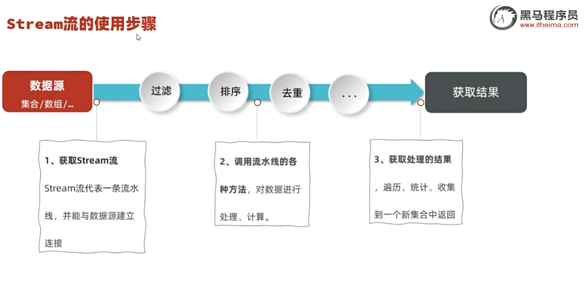

# Java Stream流与可变参数笔记

> 日期：2025-07-17

## 目录

- [认识Stream流](#认识stream流)
- [获取Stream流](#获取stream流)
- [Stream流的中间方法](#stream流的中间方法)
- [Stream流的终结方法](#stream流的终结方法)
- [可变参数](#可变参数)
- [Collections工具类](#collections工具类)

---

## 认识Stream流

Stream是JDK8开始新增的一套API (`java.util.stream.*`)，可以用于操作集合或者数组的数据。

### 优势
- 大量结合了Lambda的语法风格来编程
- **功能强大**，**性能高效**
- 代码简洁，可读性好

### Stream流处理数据的步骤
1. 先得到集合或者数组的Stream流
2. 然后调用Stream流的方法对数据进行处理
3. 获取处理的结果



---

## 获取Stream流

### 获取集合的Stream流

| Collection提供的方法 | 说明 |
| -------------------- | ---- |
| `default Stream<E> stream()` | 获取当前集合对象的Stream流 |

### 获取数组的Stream流

| Arrays类提供的方法 | 说明 |
| ------------------ | ---- |
| `public static <T> Stream<T> stream(T[] array)` | 获取当前数组的Stream流 |

| Stream类提供的方法 | 说明 |
| ------------------ | ---- |
| `public static <T> Stream<T> of(T... values)` | 获取当前接收数据的Stream流 |

### 示例代码

```java
package Stream;
import java.util.*;
import java.util.stream.Stream;

public class Demo2 {
    public static void main(String[] args) {
        // Collection -> List和Set 的Stream拿流
        List<String> list = new ArrayList<>();
        Stream<String> stream = list.stream();
        
        Set<Integer> set = new HashSet<>();
        Stream<Integer> stream1 = set.stream();
        
        // Map的Stream拿流
        Map<String, Integer> map = new HashMap<>();
        Stream<String> stream2 = map.keySet().stream();
        Stream<Integer> stream3 = map.values().stream();
        Stream<Map.Entry<String,Integer>> stream4 = map.entrySet().stream();
        
        // 数组拿流
        String[] arr = {"张三", "李四", "王五", "赵六"};
        Stream<String> stream5 = Arrays.stream(arr);
        System.out.println(stream5.count()); // 计数
        
        Stream<String> stream6 = Stream.of("张三", "李四", "王五", "赵六"); // 可变参数建流
    }
}
```

---

## Stream流的中间方法

中间方法指的是调用完成后会返回新的Stream流，可以继续使用（支持链式编程）。

| Stream提供的常用中间方法 | 说明 |
| ------------------------ | ---- |
| `Stream<T> filter(Predicate<? super T> predicate)` | 用于对流中的数据进行过滤 |
| `Stream<T> sorted()` | 对元素进行升序排序 |
| `Stream<T> sorted(Comparator<? super T> comparator)` | 按照指定规则排序 |
| `Stream<T> limit(long maxSize)` | 获取前几个元素 |
| `Stream<T> skip(long n)` | 跳过前几个元素 |
| `Stream<T> distinct()` | 去除流中重复的元素 |
| `<R> Stream<R> map(Function<? super T,? extends R> mapper)` | 对元素进行加工，并返回对应的新流 |
| `static <T> Stream<T> concat(Stream a, Stream b)` | 合并a和b两个流为一个流 |

### 示例代码

```java
package Stream;
import java.util.*;
import java.util.stream.Stream;

public class Demo1 {
    public static void main(String[] args) {
        List<String> list = new ArrayList<>();
        list.add("张无忌");
        list.add("周芷若");
        list.add("赵敏");
        list.add("张强");
        list.add("张三丰");
        list.add("张翠山");
        
        // 筛选姓张且长度为3的名字
        list.stream().filter(e -> e.startsWith("张") && e.length() == 3)
                .forEach(System.out::println);
        
        List<Double> score = new ArrayList<>();
        score.add(66.6);
        score.add(66.8);
        score.add(78.0);
        score.add(96.0);
        score.add(96.0);
        score.add(88.8);
        
        // 默认从小到大排序
        score.stream().sorted().forEach(System.out::println);
        
        System.out.println("===================================");
        // 从大到小排序，只要前两名
        score.stream().sorted((o1, o2) -> Double.compare(o2, o1))
                .limit(2)
                .forEach(System.out::println);
        
        System.out.println("===================================");
        // 跳过前两名
        score.stream().sorted((o1, o2) -> Double.compare(o2, o1))
                .skip(2)
                .forEach(System.out::println);
        
        System.out.println("===================================");
        // 去重（需要重写hashcode equals）
        score.stream().sorted((o1, o2) -> Double.compare(o2, o1))
                .distinct()
                .forEach(System.out::println);
        
        System.out.println("===================================");
        // 映射方法把流上的数据拿下来然后加工
        score.stream().map(e -> e + 10) // 流内的每个元素都加10
                .forEach(System.out::println);
        
        System.out.println("===================================");
        // 合并流
        Stream<Object> obj = Stream.concat(score.stream(), list.stream());
        obj.forEach(System.out::println);
    }
}
```

---

## Stream流的终结方法

终结方法指的是调用完成后，不会返回新Stream了，没法继续使用流了。

| Stream提供的常用终结方法 | 说明 |
| ------------------------ | ---- |
| `void forEach(Consumer action)` | 对此流运算后的元素执行遍历 |
| `long count()` | 统计此流运算后的元素个数 |
| `Optional<T> max(Comparator<? super T> comparator)` | 获取此流运算后的最大值元素 |
| `Optional<T> min(Comparator<? super T> comparator)` | 获取此流运算后的最小值元素 |

### 示例代码

```java
package Stream;
import java.util.*;
import java.util.stream.Collectors;

public class Demo3 {
    public static void main(String[] args) {
        List<Teacher> list = new ArrayList<>();
        list.add(new Teacher("张三", 30, "语文", 16000));
        list.add(new Teacher("李四", 35, "数学", 18000));
        list.add(new Teacher("王五", 40, "英语", 20000));
        list.add(new Teacher("赵六", 45, "物理", 20000));
        list.add(new Teacher("张强", 50, "化学", 22000));
        
        // forEach
        list.stream().filter(t -> t.getSalary() > 18000).forEach(System.out::println);
        
        System.out.println("---------------------------");
        // count
        long count = list.stream().filter(t -> t.getSalary() > 18000).count();
        System.out.println("工资大于18000的教师人数: " + count);
        
        // max
        Teacher maxSalaryTeacher = list.stream()
                .max((t1, t2) -> Double.compare(t1.getSalary(), t2.getSalary()))
                .orElse(null); // Optional的orElse方法，如果没找到则返回null
        System.out.println("工资最高的教师: " + maxSalaryTeacher);
        
        // min
        Teacher minSalaryTeacher = list.stream()
                .min((t1, t2) -> Double.compare(t1.getSalary(), t2.getSalary()))
                .orElse(null);
        System.out.println("工资最低的教师: " + minSalaryTeacher);
        
        System.out.println("---------------------------");
        // 收集到Map中
        Map<String, Double> map = list.stream()
                .collect(Collectors.toMap(t -> t.getName(), t -> t.getSalary()));
        // Collectors.toMap() 是个终结方法，返回一个Map集合
        map.forEach((a, b) -> System.out.println(a + "," + b));
    }
}
```

### 收集方法示例

```java
package Stream;

import java.util.ArrayList;
import java.util.HashSet;
import java.util.List;

import java.util.Set;
import java.util.stream.Collectors;
import java.util.stream.Stream;

public class Demo4 {
    public static void main(String[] args) {
        List<String> list = new ArrayList<>();
        list.add("张无忌");
        list.add("周芷若");
        list.add("赵敏");
        list.add("张强");
        list.add("张三丰");
        list.add("张翠山");
        
        // JDK16+ 直接使用toList()
        List<String> list2 = list.stream()
                .filter(e -> e.startsWith("张") && e.length() == 3)
                .toList();
        
        // JDK16之前使用collect(Collectors.toList())
        // List<String> list2 = list.stream().filter(e-> e.startsWith("张")&&e.length()==3).collect(Collectors.toList());
        
        // 去重
        Set<String> set = new HashSet<>();
        set.addAll(list2);
        
        // 转换为数组
        Stream<String> stream = list.stream().filter(e -> e.startsWith("张"));
        Object[] arr = stream.toArray();
    }
}
```

---

## 可变参数

```java
public class Demo1 {
    public static void main(String[] args) {
        // 可变参数
        sum(1, 2, 3);
    }
    
    // 实质上nums是一个数组
    public static void sum(int... nums) {
        // 可变参数可以接收任意数量的int类型参数
        int sum = 0;
        for (int num : nums) {
            sum += num;
        }
        System.out.println("Sum: " + sum);
    }
}
```

---

## Collections工具类

Collections工具类用于操作集合。

```java
import java.util.*;

public class Demo2 {
    public static void main(String[] args) {
        List<String> list = new ArrayList<>();
        // 便捷添加
        Collections.addAll(list, "a", "b", "c", "e", "d");
        
        Set<String> set = new HashSet<>();
        Collections.addAll(set, "d", "d", "e", "f");
        
        System.out.println(list);
        System.out.println(set);
        
        // 随机打乱
        Collections.shuffle(list);
        System.out.println("打乱后：" + list);
        
        // 排序
        Collections.sort(list);
        System.out.println("排序后：" + list); // 默认升序
        
        // 自定义排序
        Collections.sort(list, (o1, o2) -> o2.compareTo(o1)); // 降序
        System.out.println("自定义排序后：" + list);
    }
}
```

### 总结

1. **Stream流的优势**：简化集合操作，支持链式编程，代码简洁
2. **处理步骤**：获取流 → 中间操作 → 终结操作
3. **可变参数**：实质是数组，可接收任意数量的同类型参数
4. **Collections工具类**：提供便捷的集合操作方法

---

## 案例：斗地主小游戏

### 业务需求分析
- 总共有54张牌
- 点数: "3", "4", "5", "6", "7", "8", "9", "10", "J", "Q", "K", "A", "2"
- 花色: "♠", "♥", "♣", "♦"
- 大小王: "小王", "大王"
- 斗地主: 发出51张牌，剩下3张做为底牌

### 实现分析
- 启动游戏房间时，提前准备好54张牌
- 完成洗牌、发牌、对牌排序、看牌

### 代码实现

**Card类：**

```java
package Dynamic;
import lombok.AllArgsConstructor;
import lombok.Data;
import lombok.NoArgsConstructor;

@Data
@AllArgsConstructor
@NoArgsConstructor
public class Card {
    private int cardNo;
    private String size;
    private String color;
    
    public String toString() {
        return size + color;
    }
}
```

**Room类：**

```java
package Dynamic;
import java.util.*;

public class Room {
    private ArrayList<Card> cards = new ArrayList<>();
    
    {
        // 准备扑克点数
        String[] sizes = {"3", "4", "5", "6", "7", "8", "9", "10", "J", "Q", "K", "A", "2"};
        // 准备花色
        String[] colors = {"♠", "♥", "♣", "♦"};
        
        for(int i = 0; i < sizes.length; i++) {
            for(String color : colors) {
                Card card = new Card(i, sizes[i], color);
                cards.add(card);
            }
        }
        cards.add(new Card(14, "小王", ""));
        cards.add(new Card(15, "大王", ""));
    }
    
    public void Start() {
        // 洗牌
        Collections.shuffle(cards);
        
        Map<String, List<Card>> Player = new HashMap<>();
        ArrayList<Card> player1 = new ArrayList<>();
        ArrayList<Card> player2 = new ArrayList<>();
        ArrayList<Card> player3 = new ArrayList<>();
        
        // 发牌
        for(int i = 0; i < cards.size() - 3; i++) {
            if(i % 3 == 0) {
                player1.add(cards.get(i));
            } else if(i % 3 == 1) {
                player2.add(cards.get(i));
            } else {
                player3.add(cards.get(i));
            }
        }
        
        Player.put("玩家1", player1);
        Player.put("玩家2", player2);
        Player.put("玩家3", player3);
        
        // 排序
        Player.forEach((k, v) -> {
            v.sort(Comparator.comparing(Card::getCardNo));
        });
        
        // 显示玩家手牌
        Player.forEach((k, v) -> {
            System.out.println(k + "的牌:" + v);
        });
        
        // 剩余的三张牌（底牌）
        List<Card> leftCards = cards.subList(51, 54);
        Player.get("玩家1").addAll(leftCards);
        Player.get("玩家1").sort(Comparator.comparing(Card::getCardNo));
        System.out.println("玩家1获得底牌后的牌:" + Player.get("玩家1"));
    }
}
```

**GameDemo类：**

```java
package Dynamic;

public class GameDemo {
    public static void main(String[] args) {
        Room room = new Room();
        room.Start();
    }
}
```

### 案例要点总结

1. **集合初始化**：使用实例代码块在对象创建时初始化牌组
2. **洗牌**：使用 `Collections.shuffle()` 打乱牌的顺序
3. **发牌逻辑**：使用取模运算实现轮流发牌
4. **排序**：使用 `Comparator.comparing()` 方法引用进行排序
5. **数据结构**：使用 `Map<String, List<Card>>` 存储玩家和手牌的映射关系
