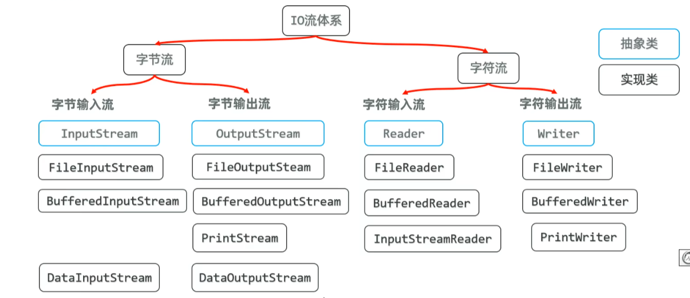

# Java IO流笔记

> 日期：2025-07-19

## 目录

- [IO流概述](#io流概述)
- [字节流](#字节流)
- [字符流](#字符流)
- [缓冲流](#缓冲流)
- [转换流](#转换流)
- [打印流](#打印流)
- [数据流](#数据流)
- [Commons-io框架](#commons-io框架)

---

## IO流概述



IO流用于处理设备之间的数据传输，分为输入流和输出流：
- **输入流**：从数据源读取数据到程序
- **输出流**：从程序写出数据到目的地

---

## 字节流

### 字节输入流 InputStream（抽象类）

**FileInputStream**（实现类）可以把硬盘数据读入内存。

#### 基本读取方式

```java
package IOStream;
import java.io.*;

public class Demo1 {
    public static void main(String[] args) throws Exception {
        File a = new File("Day2\\src\\IOStream\\1.txt");
        InputStream in = new FileInputStream(a);
        int ff;
        while ((ff = in.read()) != -1) {
            System.out.println((char)ff);
        } // 性能低下，无法读取汉字
        in.close();
        
        // 使用字节数组读取
        InputStream sa = new FileInputStream(a);
        byte[] buffer = new byte[1024];
        int f = sa.read(buffer); // 读取多个字符很方便，降低硬盘内存交互
        String c = new String(buffer, 0, f);
        System.out.println(c);
    }
}
```

#### 一次读取全部文件

```java
package IOStream;
import java.io.FileInputStream;
import java.io.InputStream;

public class Demo4 {
    public static void main(String[] args) throws Exception {
        InputStream s = new FileInputStream("Day2\\src\\IOStream\\1.txt");
        byte[] buffer = s.readAllBytes();
        String content = new String(buffer);
        System.out.println("File content:" + content);
    }
} // 一次性读完全部字节
```

### 字节输出流 OutputStream

#### FileOutputStream 文件字节输出流

作用：以内存为基准，把内存中的数据以字节的形式写出到文件中去。

| 构造器 | 说明 |
| ------ | ---- |
| `public FileOutputStream(File file)` | 创建字节输出流管道与源文件对象接通 |
| `public FileOutputStream(String filepath)` | 创建字节输出流管道与源文件路径接通 |
| `public FileOutputStream(File file, boolean append)` | 创建字节输出流管道与源文件对象接通，可追加数据 |
| `public FileOutputStream(String filepath, boolean append)` | 创建字节输出流管道与源文件路径接通，可追加数据 |

| 方法名称 | 说明 |
| -------- | ---- |
| `public void write(int a)` | 写一个字节出去 |
| `public void write(byte[] buffer)` | 写一个字节数组出去 |
| `public void write(byte[] buffer, int pos, int len)` | 写一个字节数组的一部分出去 |
| `public void close() throws IOException` | 关闭流 |

#### 示例代码

```java
package IOStream;
import java.io.*;

public class OutputDemo {
    public static void main(String[] args) throws Exception {
        String s = "Hello, World!\n早上好中国，现在我有BingChiling";
        OutputStream os = new FileOutputStream("Day2\\src\\IOStream\\output.txt");
        
        byte[] bytes = s.getBytes(); // 将字符串转换为字节数组
        os.write(bytes); // 写入字节数组到输出流
        os.close(); // 关闭输出流
        
        // 追加模式
        OutputStream oss = new FileOutputStream("Day2\\src\\IOStream\\output.txt", true);
        String ff = "Hello,China!";
        oss.write(ff.getBytes(), 0, 5);
        oss.close();
    }
}
```

### 文件复制操作

```java
package IOStream;
import java.io.*;

public class IODemo1 {
    public static void main(String[] args) throws Exception {
        // JDK7以后的try-with-resources语法
        try (
            InputStream in = new FileInputStream("Day2/src/IOStream/1.png");
            OutputStream out = new FileOutputStream("Day2/src/IOStream/2.png", true)
        ) {
            int s;
            byte[] b = new byte[4096];
            while((s = in.read(b)) != -1) {
                out.write(b, 0, s); // 写入读取的字节
            }
        } catch (IOException e) {
            e.printStackTrace();
        }
        // 资源对象一定要直接/间接实现AutoCloseable接口
    }
}
```

---

## 字符流

### 字符输入流 Reader（抽象类）

#### FileReader 文件字符输入流

作用：以内存为基准，可以把文件中的数据以字符的形式读入到内存中去。

| 构造器 | 说明 |
| ------ | ---- |
| `public FileReader(File file)` | 创建字符输入流管道与源文件接通 |
| `public FileReader(String pathname)` | 创建字符输入流管道与源文件接通 |

| 方法名称 | 说明 |
| -------- | ---- |
| `public int read()` | 每次读取一个字符返回，如果发现没有数据可读会返回-1 |
| `public int read(char[] buffer)` | 每次用一个字符数组去读取数据，返回字符数组读取了多少个字符 |

### 字符输出流 Writer

**注意**：Writer使用缓冲区，需要及时调用 `flush()` 刷新缓冲区确保数据写入文件。

```java
package RWer;
import java.io.*;

public class Demo1 {
    public static void main(String[] args) {
        try (
            Reader in = new FileReader("Day2/src/RWer/1.txt");
            Writer out = new FileWriter("Day2/src/RWer/2.txt", true)
        ) {
            char[] buffer = new char[1024];
            int s;
            StringBuffer sb = new StringBuffer();
            while((s = in.read(buffer)) != -1) {
                String content = new String(buffer, 0, s);
                sb.append(content);
                out.write(buffer, 0, s); // 写入读取的字符
            }
            System.out.println("内容" + sb.toString());
            out.write("\n");
            out.write("这是追加的内容\n");
            out.write((int)('A')); // 写入字符A
            out.write("这是追加的内容222", 0, 2);
            out.flush(); // 刷新缓冲区，确保数据写入文件
        } catch(Exception e) {
            e.printStackTrace();
        }
    }
}
```

---

## 缓冲流

### 缓冲流的种类
- **字节缓冲输入流**：BufferedInputStream
- **字节缓冲输出流**：BufferedOutputStream
- **字符缓冲输入流**：BufferedReader
- **字符缓冲输出流**：BufferedWriter

### 缓冲流的优势
- 字节缓冲流自带8KB缓冲区，相当于内存到硬盘缓冲层
- 可以提高原始字节流、字符流读写数据的性能

### 字符缓冲流特有功能
- **BufferedReader**：`String readLine()` 按行读取
- **BufferedWriter**：`void newLine()` 换行

```java
package RWer;
import java.io.*;

public class Demo1 {
    public static void main(String[] args) {
        try (
            Reader in = new FileReader("Day2/src/RWer/1.txt");
            Writer out = new FileWriter("Day2/src/RWer/2.txt", true);
            BufferedReader input = new BufferedReader(in);
            BufferedWriter output = new BufferedWriter(out)
        ) {
            String line;
            while((line = input.readLine()) != null) {
                System.out.println(line); // 输出读取的行
                output.write(line + "\n"); // 写入到输出流
                output.newLine(); // 换行
            }
            output.flush(); // 刷新缓冲区，确保数据写入文件
        } catch(Exception e) {
            e.printStackTrace();
        }
    }
}
```

### 案例：排序出师表

```java
package RWer;

import java.io.*;
import java.util.ArrayList;

public class Demo2 {
    public static void main(String[] args) {
        // 读取文件内容
        try (
                Reader in = new FileReader("Day2/src/RWer/csb.txt"); // 读取文件
                BufferedReader input = new BufferedReader(in); // 使用缓冲读取
                Writer out = new FileWriter("Day2/src/RWer/csb_copy.txt", true); // 输出到另一个文件
                BufferedWriter output = new BufferedWriter(out); // 使用缓冲写入
        ) {
            String line;
            ArrayList<String> lines = new ArrayList<>(); // 用于存储读取的行
            while ((line = input.readLine()) != null) {
                System.out.println(line); // 输出读取的行
                lines.add(line); // 将行添加到列表中
            }
            lines.sort(String::compareTo); // 对行进行排序
            for (String sortedLine : lines) {
                output.write(sortedLine + "\n"); // 写入到输出流
            }
            output.flush(); // 刷新缓冲区，确保数据写入文件
        } catch (
                Exception e) {
            e.printStackTrace();
        }
    }
}
```

---

## 转换流

字符输入转换流可以转换流内文字编码：

```java
InputStream is = new FileInputStream("1.txt");
Reader input = new InputStreamReader(is, "GBK");
BufferedReader br = new BufferedReader(input);
```

---

## 打印流

PrintStream/PrintWriter 提供便捷的打印功能：

```java
PrintStream ps = new PrintStream("1.txt");
PrintStream ps = new PrintStream(new FileOutputStream("1.txt", true)); // 可实现追加功能
ps.println(99);
ps.println("a");
ps.println("aaa");
// PrintWriter同用
```

---

## 数据流

DataInputStream/DataOutputStream 用于读写基本数据类型：

```java
DataOutputStream dos = new DataOutputStream(new FileOutputStream("1.txt"));
dos.writeInt(123);
dos.writeByte(1);
dos.writeDouble(3.14);
dos.writeUTF("Hello");
// 怎么发就要以什么类型接收
```

---

## Commons-io框架

Commons-io是Apache开源基金组织提供的一组有关IO操作的小框架，目的是提高IO流的开发效率。

### FileUtils类提供的方法

| 方法 | 说明 |
| ---- | ---- |
| `public static void copyFile(File srcFile, File destFile)` | 复制文件 |
| `public static void copyDirectory(File srcDir, File destDir)` | 复制文件夹 |
| `public static void deleteDirectory(File directory)` | 删除文件夹 |
| `public static String readFileToString(File file, String encoding)` | 读数据 |
| `public static void writeStringToFile(File file, String data, String charname, boolean append)` | 写数据 |

### IOUtils类提供的方法

| 方法 | 说明 |
| ---- | ---- |
| `public static int copy(InputStream inputStream, OutputStream outputStream)` | 复制文件 |
| `public static int copy(Reader reader, Writer writer)` | 复制文件 |
| `public static void write(String data, OutputStream output, String charsetName)` | 写数据 |

### 总结

1. **字节流**：处理所有类型的文件，以字节为单位
2. **字符流**：处理文本文件，以字符为单位，对中文支持更好
3. **缓冲流**：提高IO性能，减少与硬盘的交互次数
4. **转换流**：实现字节流与字符流的转换，处理编码问题
5. **打印流**：提供便捷的打印功能
6. **数据流**：读写基本数据类型
7. **Commons-io框架**：简化常见IO操作，提高开发效率