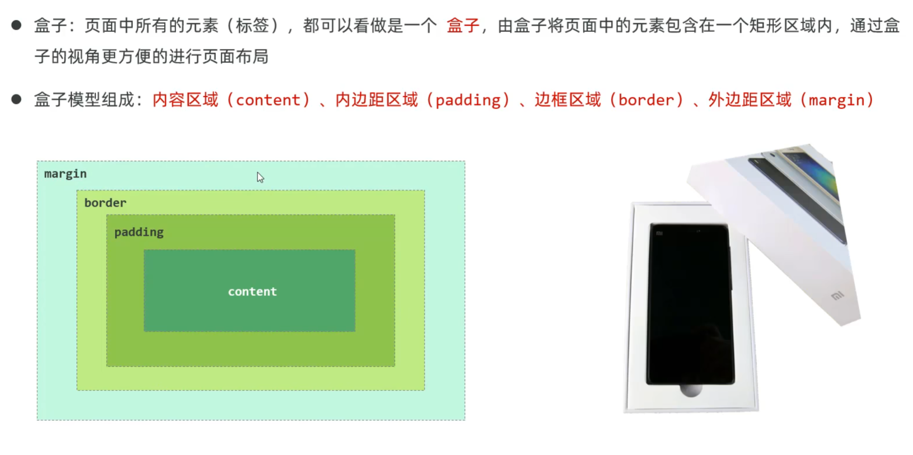
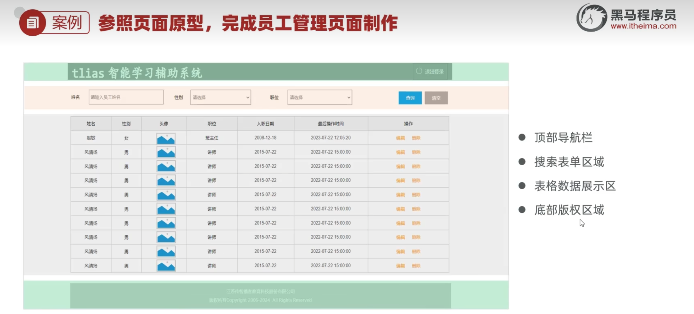

# JavaWeb HTML CSS 笔记（二）

> 日期：2025-07-23

## 目录

- [实现页面居中](#实现页面居中)
- [盒子模型与布局标签](#盒子模型与布局标签)
- [div与span的区别](#div与span的区别)
- [盒子模型常用CSS属性](#盒子模型常用css属性)
- [页面原型](#页面原型)
- [表格标签](#表格标签)
- [表单标签](#表单标签)
- [Flex布局](#flex布局)

---

## 实现页面居中

- 把所有内容包裹在 `<div>` 标签内
- 例如：`<div id="content-container">`
- 在 `<style>` 内定义：

```css
#content-container {
    max-width: 800px;
    margin: 0 auto; /* 居中显示 */
}
```

---

## 盒子模型与布局标签



- **布局标签**：常用 `div` 和 `span`，无语义，仅用于布局

---

## div与span的区别

- `<div>` 标签：
  - 块级元素，一行只显示一个（独占一行）
  - 宽度默认是父元素的宽度，高度由内容撑开
  - 可以设置宽高（`width`、`height`）

- `<span>` 标签：
  - 行内元素，一行可以显示多个
  - 宽高由内容撑开，不能设置宽高

---

## 盒子模型常用CSS属性

```css
div {
    width: 200px;
    height: 100px;
    background-color: #05a5d2;
    /* 上下左右 */
    padding: 20px 20px 20px 20px;
    border: 20px solid #6bd5d7;
    margin: 30px 30px 30px 30px;
}
```

```css
div {
    width: 200px;
    height: 100px;
    background-color: #05a5d2;
    /* 上下 和 左右 */
    padding: 20px 20px;
    border: 20px solid #6bd5d7;
    margin: 30px 30px;
}
```

```css
div {
    width: 200px;
    height: 100px;
    background-color: #05a5d2;
    /* 四边都是 */
    padding: 20px;
    border: 20px solid #6bd5d7;
    margin: 30px;
}
```

---

## 演示代码

```html
<!DOCTYPE html>
<html lang="zh_cn">
<head>
    <meta charset="UTF-8">
    <meta name="viewport" content="width=device-width, initial-scale=1.0">
    <title>Document</title>
    <style>
        #div1{
            color: red;
            background-color: #f0f0f0;
            width: 300px; 
            height: 300px; 
            /* 内边距大小 */
            padding: 20px; 
            border : 10px solid #000; /* 边框大小和颜色 */
            box-sizing: border-box; /* 边框大小包括内边距padding和边框border */
            margin: 30px auto; /* 浏览器自适应 */
        }
    </style>
</head>
<body>
    <div id = "div1">A A A A A A A A A A A A A A A A A A</div>
    <!-- <div id = "div2">AAAAAAAAAAAAA</div> -->
    <!-- <span>BBBBBB</span>
    <span>BBBBBB</span> -->
</body>
</html>
```
### 页面原型

指在应用程序开发初期，由产品经理制作的一个早期项目模型，它用于展示页面的基本布局、功能和交互设计。通常用来帮助设计师、开发者等更好地理解和讨论最终产品的外观和行为。

### 表格标签

- **场景**：在网页中以表格（行、列）形式整齐展示数据，如班级表

| 标签      | 描述                             | 属性/备注                                                    |
| --------- | -------------------------------- | ------------------------------------------------------------ |
| `<table>` | 定义表格整体，可以包裹多个`<tr>` | `border`：规定表格边框的宽度<br>`width`：规定表格的宽度<br>`cellspacing`：规定单元之间的空间 |
| `<tr>`    | 表格的行，可以包裹多个`<td>`     |                                                              |
| `<td>`    | 表格单元格(普通)，可以包裹内容   | 如果是表头单元格，可以替换为`<th>`                           |

---

## 表单标签

- **场景**：在网页中主要负责数据采集功能，如注册、登录等数据采集
- **标签**：`<form>`
- 属性：
  - `action`：规定当提交表单时向何处发送表单数据，URL
  - `method`：规定用于发送表单数据的方式。GET、POST
- **表单项**：不同类型的`input`元素、下拉列表、文本域等
  - `<input>`：定义表单项，通过`type`属性控制输入形式
  - `<select>`：定义下拉列表
  - `<textarea>`：定义文本域

### 表单项类型

| type 取值               | 描述                                 |
|-------------------------|--------------------------------------|
| text                    | 默认值，定义单行的输入字段           |
| password                | 定义密码字段                         |
| radio                   | 定义单选按钮                         |
| checkbox                | 定义复选框                           |
| file                    | 定义文件上传按钮                     |
| date/time/datetime-local| 定义日期/时间/日期时间               |
| number                  | 定义数字输入框                       |
| email                   | 定义邮件输入框                       |
| hidden                  | 定义隐藏域                           |
| submit / reset / button | 定义提交按钮 / 重置按钮 / 可点击按钮 |

---

## Flex布局

- **flex**是flexible Box的缩写，意为"弹性布局"，是一种一维的布局模型
- flex布局可以为元素之间提供强大的空间分布和对齐能力
- 通过给父容器添加flex的相关属性，来控制子元素的位置和排列方式

| 属性                                  | 取值          | 含义                                   |
| ------------------------------------- | ------------- | -------------------------------------- |
| display                               | flex          | 使用flex布局                           |
| flex-direction（设置主轴）            | row           | 主轴方向为x轴，水平向右（默认）        |
|                                       | column        | 主轴方向为y轴，垂直向下                |
| justify-content（子元素在主轴上的对齐方式） | flex-start    | 从头开始排列                           |
|                                       | flex-end      | 从尾部开始排列                         |
|                                       | center        | 在主轴居中对齐                         |
|                                       | space-around  | 平分剩余空间                           |
|                                       | space-between | 先两边贴边，再平分剩余空间             |

### Flex布局示例

```html
<!DOCTYPE html>
<html lang="zh_cn">
<head>
    <meta charset="UTF-8">
    <meta name="viewport" content="width=device-width, initial-scale=1.0">
    <title>Flex布局示例</title>
    <style>
        #main_container{
            background-color: blue;
            width : 800px;
            height: 600px;
            /* 设置为弹性布局 */
            display: flex;
            /* 设置主轴方向为水平方向（默认） */
            flex-direction: row;
            /* 设置主轴对齐方式 */
            justify-content: space-between;
        }
        #item{
            width : 80px;
            height: 60px;
            border: 1px solid black;
            background-color: red;
        }
    </style>
</head>
<body>
    <div id = "main_container">
        <div id = "item">item1</div>
        <div id = "item">item2</div>
        <div id = "item">item3</div>
    </div>
</body>
</html>
```

---

## 页脚区域

页脚（footer）通常位于网页底部，包含版权信息、联系方式、友情链接等内容。

### 页脚常用特点

- 固定在页面底部
- 包含网站相关信息
- 样式相对简单，通常背景色较深

### 页脚示例

```html
<footer>
    <div class="footer-container">
        <p>&copy; 2025 公司名称. 版权所有.</p>
        <div class="footer-links">
            <a href="#about">关于我们</a>
            <a href="#contact">联系我们</a>
            <a href="#privacy">隐私政策</a>
        </div>
    </div>
</footer>
```

```css
footer {
    background-color: #333;
    color: white;
    text-align: center;
    padding: 20px 0;
    margin-top: auto; /* 自动推到底部 */
}

.footer-container {
    max-width: 1200px;
    margin: 0 auto;
}

.footer-links a {
    color: white;
    text-decoration: none;
    margin: 0 15px;
}

.footer-links a:hover {
    text-decoration: underline;
}
```

### 粘性页脚（Sticky Footer）

使用Flex布局实现粘性页脚，确保页脚始终在页面底部：

```css
body {
    display: flex;
    flex-direction: column;
    min-height: 100vh;
    margin: 0;
}

main {
    flex: 1; /* 主内容区域占据剩余空间 */
}

footer {
    background-color: #333;
    color: white;
    padding: 20px 0;
    text-align: center;
}
```

HTML CSS 完结撒花~