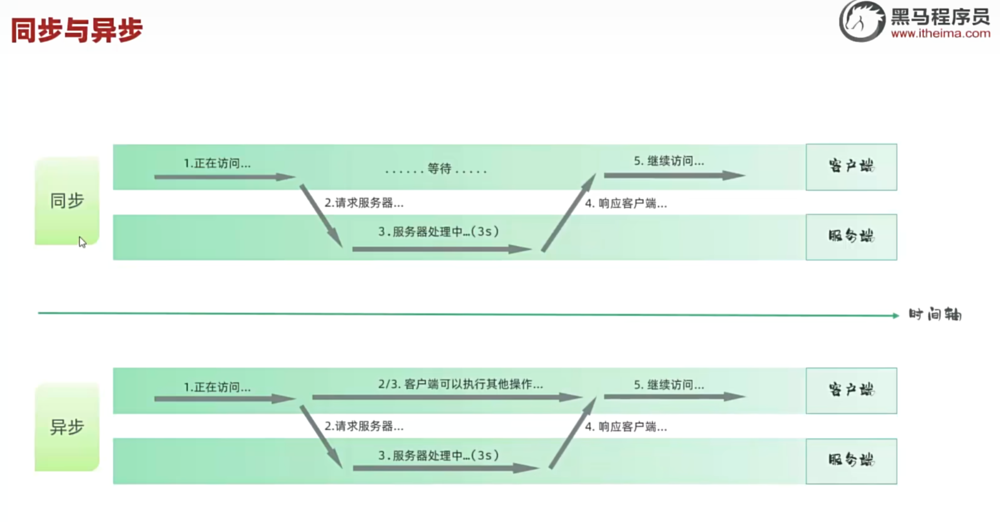

# JavaWeb Ajax 学习笔记

> 日期：2025年7月28日

---

## 目录

- [1. 什么是 Ajax](#1-什么是-ajax)
- [2. XML 简介](#2-xml-简介)
- [3. 同步与异步](#3-同步与异步)
- [4. Axios 简介与用法](#4-axios-简介与用法)
- [5. Axios 请求示例](#5-axios-请求示例)
- [6. Vue 生命周期](#6-vue-生命周期)
- [7. async 和 await](#7-async-和-await)
- [8. 综合案例：智能学习辅助系统](#8-综合案例智能学习辅助系统)
- [9. 总结](#9-总结)

---

## 1. 什么是 Ajax

- **Ajax**（Asynchronous JavaScript And XML）：一种在无需重新加载整个页面的情况下，能够与服务器交换数据并更新部分网页内容的技术。
- **核心作用**：
  - 异步数据交换
  - 局部刷新页面
  - 提升用户体验
- **常见应用**：搜索联想、表单校验、动态内容加载等。

---

## 2. XML 简介

- **XML**（Extensible Markup Language）：可扩展标记语言，是一种常用的数据交换格式，也可用 JSON 替代。

---

## 3. 同步与异步

- **同步**：请求发送后，必须等待服务器响应，才能进行后续操作。
- **异步**：请求发送后，无需等待服务器响应，可以继续执行后续代码，响应到来时再处理。
-  <!-- 如有图片可用，否则可删除此行 -->

---

## 4. Axios 简介与用法

- **Axios**：基于 Promise 的 HTTP 客户端，对原生 Ajax 进行了封装，使用简单，支持各种请求方式。
- 官网：[axios-http.cn](https://axios-http.cn/)
- **基本用法**：
  ```js
  axios({
    method: 'GET',
    url: '请求路径',
    data: {},   // POST 请求体
    params: {}  // GET 请求参数
  }).then().catch();
  ```
- **简写方式**：
  ```js
  axios.get(url, config)
  axios.post(url, data, config)
  ```
- **请求方式别名**：`axios.get`、`axios.post`、`axios.put`、`axios.delete` 等

---

## 5. Axios 请求示例

```html
<!DOCTYPE html>
<html lang="en">
<head>
    <meta charset="UTF-8">
    <meta name="viewport" content="width=device-width, initial-scale=1.0">
    <title>Axios 示例</title>
</head>
<body>
    <input type="button" value="GET 请求" id="forget">
    <input type="button" value="POST 请求" id="forpost">
    <script src="https://unpkg.com/axios/dist/axios.min.js"></script>
    <script>
        // GET 请求
        document.querySelector("#forget").addEventListener("click", () => {
            axios.get("https://mock.apifox.cn/m1/3083103-0-default/emps/list")
                .then(response => console.log(response))
                .catch(error => console.log(error));
        });
        // POST 请求
        document.querySelector("#forpost").addEventListener("click", () => {
            axios.post("https://mock.apifox.cn/m1/3083103-0-default/emps/update", "id=1")
                .then(response => console.log(response))
                .catch(error => console.log(error));
        });
    </script>
</body>
</html>
```

---

## 6. Vue 生命周期

- Vue3 生命周期的八个阶段（钩子）：

| 状态           | 阶段周期     |
|----------------|--------------|
| beforeCreate   | 创建前       |
| created        | 创建后       |
| beforeMount    | 载入前       |
| mounted        | 挂载完成     |
| beforeUpdate   | 数据更新前   |
| updated        | 数据更新后   |
| beforeUnmount  | 组件销毁前   |
| unmounted      | 组件销毁后   |

---

## 7. async 和 await

- **async/await** 是 JavaScript 中处理异步操作的关键字。
- 让异步代码写起来像同步代码，更易读。
- `async` 用于定义异步函数，`await` 用于等待 Promise 完成。

**示例：**
```js
async function fetchData() {
  let result = await axios.get('/api/data');
  console.log(result.data);
}
```

---

## 8. 综合案例智能学习辅助系统

> 结合 Vue3 + Axios，实现前端根据查询条件获取后端数据并渲染表格。

```html
<!DOCTYPE html>
<html lang="zh-CN">
<head>
    <meta charset="UTF-8">
    <meta name="viewport" content="width=device-width, initial-scale=1.0">
    <title>Tlias智能学习辅助系统</title>
    <style>
      body {
        margin: 0;
      }

      /* 顶栏样式 */
      .header {
        display: flex;
        justify-content: space-between;
        align-items: center;
        background-color: #c2c0c0;
        padding: 20px 20px;
        box-shadow: 0 2px 5px rgba(0,0,0,0.1);
      }
      
      /* 加大加粗标题 */
      .header h1 {
        margin: 0;
        font-size: 24px;
        font-weight: bold;
      }

      /* 文本链接样式 */
      .header a {
        text-decoration: none;
        color: #333;
        font-size: 16px;
      }

      /* 搜索表单区域 */
      .search-form {
        display: flex;
        align-items: center;
        padding: 20px;
        background-color: #f9f9f9;
      }

      /* 表单控件样式 */
      .search-form input[type="text"], .search-form select {
        margin-right: 10px;
        padding: 10px 10px;
        border: 1px solid #ccc;
        border-radius: 4px;
        width: 26%;
      }

      /* 按钮样式 */
      .search-form button {
        padding: 10px 15px;
        margin-left: 10px;
        background-color: #007bff;
        color: white;
        border: none;
        border-radius: 4px;
        cursor: pointer;
      }

      /* 清空按钮样式 */
      .search-form button.clear {
        background-color: #6c757d;
      }

      .table {
         min-width: 100%; 
         border-collapse: collapse;
      }

      /* 设置表格单元格边框 */
      .table td, .table th { 
        border: 1px solid #ddd; 
        padding: 8px; 
        text-align: center;
      }
      
      .avatar { 
        width: 30px; 
        height: 30px; 
        object-fit: cover; 
        border-radius: 50%; 
      }

      /* 页脚版权区域 */
    .footer {
        background-color: #c2c0c0;
        color: white;
        text-align: center;
        padding: 10px 0;
        margin-top: 30px;
    }

    .footer .company-name {
        font-size: 1.1em;
        font-weight: bold;
    }

    .footer .copyright {
        font-size: 0.9em;
    }

    #container {
      width: 80%;
      margin: 0 auto;
    }
    </style>
</head>
<body>
    
  <div id="container">
    <!-- 顶栏 -->
    <div class="header">
      <h1>Tlias智能学习辅助系统</h1>
      <a href="#">退出登录</a>
    </div>
    
    <!-- 搜索表单区域 -->
    <form class="search-form">
      <input type="text" name="name" placeholder="姓名" v-model="searchEmp.name" />
      <select name="gender" v-model="searchEmp.gender">
          <option value="">性别</option>
          <option value="1">男</option>
          <option value="2">女</option>
      </select>
      <select name="job" v-model="searchEmp.job">
          <option value="">职位</option>
          <option value="1">班主任</option>
          <option value="2">讲师</option>
          <option value="3">学工主管</option>
          <option value="4">教研主管</option>
          <option value="5">咨询师</option>
      </select>
      <button type="button" @click="search">查询</button>
      <button type="button" @click="clear">清空</button>
    </form>

    <table class="table table-striped table-bordered">
      <thead>
          <tr>
              <th>姓名</th>
              <th>性别</th>
              <th>头像</th>
              <th>职位</th>
              <th>入职日期</th>
              <th>最后操作时间</th>
              <th>操作</th>
          </tr>
      </thead>
      <tbody>
        <tr v-for="(emp, index) in empList" :key="index">
          <td>{{ emp.name }}</td>
          <td>{{ emp.gender === 1 ? '男' : '女' }}</td>
          <td></td>
          <td>
            <span v-if="emp.job === '1'">班主任</span>
            <span v-else-if="emp.job === '2'">讲师</span>
            <span v-else-if="emp.job === '3'">学工主管</span>
            <span v-else-if="emp.job === '4'">教研主管</span>
            <span v-else-if="emp.job === '5'">咨询师</span>
          </td>
          <td>{{ emp.entrydate }}</td>
          <td>{{ emp.updatetime }}</td>
          <td class="btn-group">
            <button class="edit">编辑</button>
            <button class="delete">删除</button>
          </td>
        </tr>
      </tbody>
    </table>

    <!-- 页脚版权区域 -->
    <footer class="footer">
      <p class="company-name">江苏传智播客教育科技股份有限公司</p>
      <p class="copyright">版权所有 Copyright 2006-2024 All Rights Reserved</p>
    </footer>
    <script src="https://unpkg.com/axios/dist/axios.min.js"></script>
    <script type="module">
      import { createApp } from 'https://unpkg.com/vue@3/dist/vue.esm-browser.js'
      createApp({
        data() {
          return {
            searchEmp: {
              name: '',
              gender: '',
              job: ''
            },
            empList: []
          }
        },
        mounted() {
          this.search();
        },
        methods: {
            //原始版本
            /* search() {
            //emp.data是整个部分，然后再次.data可以获取数据赋值给empList
             axios.get(`https://web-server.itheima.net/emps/list/?name=${this.searchEmp.name}&gender=${this.searchEmp.gender}&job=${this.searchEmp.job}`)
            .then((emp)=>{this.empList = emp.data.data})
            .catch((err)=>console.log(err)); 
          }, */
          //用 async/await 改写
          // async/await 让异步代码更易读
          async search() {
            let result = await axios.get(`https://web-server.itheima.net/emps/list/?name=${this.searchEmp.name}&gender=${this.searchEmp.gender}&job=${this.searchEmp.job}`);
            this.empList = result.data.data;
          },
          clear() {
            this.searchEmp = { name: '', gender: '', job: '' }
          }
        }
      }).mount('#container')
    </script>
  </div>
</body>
</html>
```

---

## 9. 总结

- Ajax 让网页实现无刷新数据交互，提升用户体验。
- Axios 推荐用于现代前端开发，语法简洁，支持 Promise。
- Vue 生命周期和 async/await 能让前端开发更高效、易维护。
- 实际开发中建议优先使用 Axios 进行前后端通信，结合 Vue 框架实现数据驱动的动态页面。