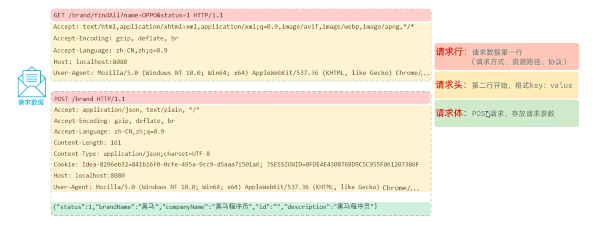
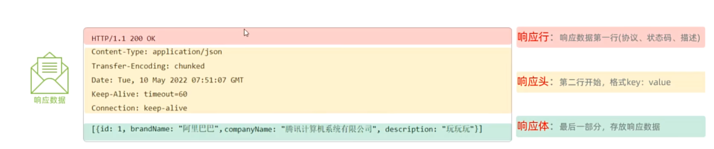

---
title: Java Web 基础学习笔记
published: 2026-03-09
description: "有关 SpringBootWeb 入门、网络架构以及 HTTP 请求/响应协议的学习笔记"
tags: ["Java", "Web", "Spring Boot", "HTTP"]
category: Java
draft: true
---

# Web基础 Spring Boot Web 入门

## 1. 基础概念

### 1.1 资源类型
- **静态资源**：服务器上存储的不会改变的数据，通常不会根据用户的请求而变化。比如：HTML、CSS、JS、图片、视频等（负责页面展示）。
- **动态资源**：服务器端根据用户请求和其他数据动态生成的，内容可能会在每次请求时都发生变化。比如：`Servlet`、`JSP` 等（负责逻辑处理）。不过上述例子已被淘汰，取而代之的是 Spring 框架。

这些资源的访问都需要 HTTP 协议，这种架构是 B/S 架构。

### 1.2 架构模式
- **B/S 架构**：Browser/Server，浏览器/服务器架构模式。客户端只需浏览器，应用程序的逻辑和数据都存在服务器端。（$\text{维护方便}$，$\text{体验一般}$）
- **C/S 架构**：Client/Server，客户端/服务器架构模式。需要单独开发维护客户端。（$\text{体验不错}$，$\text{开发维护麻烦}$）

---

## 2. Spring 框架简介

官网：[spring.io](https://spring.io)

Spring 有若干子项目用于完成特定功能，不过这些都基于 Spring Framework。
**Spring Boot** 是 Spring Framework 的一个子项目，用于简化 Spring 应用的开发和配置。它可以简化配置、自动化设置、提供开箱即用的功能等。

### 2.1 入门程序
创建一个项目，然后设计一个请求处理类（如 `HelloController`）：
- 需要在类上加上注解 `@RestController` 标明
- 指定请求路径使用 `@RequestMapping`

**示例：**
```java
@RestController
public class HelloController {
    
    // 表示当前方法是一个请求处理方法
    @RequestMapping("/hello")
    public String hello(String name) {
        System.out.println("hello " + name);
        return "hello " + name;
    }
}
```

---

## 3. HTTP 协议

- **概念**：**Hyper Text Transfer Protocol**（超文本传输协议），规定了浏览器和服务器之间数据传输的规则。
- **特点**：
  1. 基于 TCP 协议：面向连接，安全。
  2. 基于请求-响应模型：一次请求对应一次响应。
  3. 无状态协议：对于事务处理没有记忆能力。每次请求-响应都是独立的。
     - **缺点**：多次请求间不能共享数据。
     - **优点**：速度快。

---

## 4. HTTP 请求与响应处理

### 4.1 HTTP 请求协议

请求数据已被 Tomcat 解析并封装成 `HttpServletRequest` 对象，供后续处理使用。



**示例：获取请求信息**
```java
package gua3;

import jakarta.servlet.http.HttpServletRequest;
import org.springframework.web.bind.annotation.RequestMapping;
import org.springframework.web.bind.annotation.RestController;

@RestController
public class RequestController {
    
    @RequestMapping("/request")
    public String request(HttpServletRequest request) {
        StringBuilder sb = new StringBuilder();
        sb.append("请求方法: ").append(request.getMethod()).append("\n");
        sb.append("请求URL: ").append(request.getRequestURL()).append("\n");
        sb.append("请求URI: ").append(request.getRequestURI()).append("\n");
        sb.append("请求协议: ").append(request.getProtocol()).append("\n");
        sb.append("请求头: ").append("\n");
        
        // 获取全部参数内容
        sb.append("请求参数: ").append(request.getQueryString()).append("\n");
        
        // 获取特定参数内容
        System.out.println(request.getParameter("name"));
        System.out.println(sb.toString());
        
        return sb.toString();
    }
}
```

### 4.2 HTTP 响应协议

#### 状态码内容



| 状态码 | 说明 |
| --- | --- |
| `1xx` | 响应中-临时状态码，表示请求已经接收，告诉客户端应该继续请求或者如果它已经完成则忽略它。 |
| `2xx` | 成功-表示请求已经被成功接收，处理已完成。 |
| `3xx` | 重定向-重定向到其他地方；让客户端再发起一次请求以完成整个处理。 |
| `4xx` | 客户端错误-处理发生错误，责任在客户端。如：请求了不存在的资源、客户端未被授权、禁止访问等。 | 
| `5xx` | 服务器错误-处理发生错误，责任在服务端。如：程序抛出异常等。（如某个页面后端代码问题） |  

#### 常见响应头

| 响应头 | 说明 |
| --- | --- |
| `Content-Type` | 表示该响应内容的类型，例如 `text/html`，`application/json`。 |
| `Content-Length` | 表示该响应内容的长度（字节数）。 |
| `Content-Encoding` | 表示该响应压缩算法，例如 `gzip`。 |
| `Cache-Control` | 指示客户端应如何缓存，例如 `max-age=300` 表示可以最多缓存300秒。 |
| `Set-Cookie` | 告诉浏览器为当前页面所在的域设置 `cookie`。 |

#### 响应数据设置

Spring Boot 中有两种设置响应数据的方法：

**示例代码：**
```java
package gua3;

import jakarta.servlet.http.HttpServletResponse;
import org.springframework.http.ResponseEntity;
import org.springframework.web.bind.annotation.RequestMapping;
import org.springframework.web.bind.annotation.RestController;

import java.io.IOException;

@RestController
public class ResponseController {
    
    // 第一种方法：使用 HttpServletResponse
    @RequestMapping("/response")
    public void response(HttpServletResponse response) throws IOException {
        // 设置响应状态码
        response.setStatus(HttpServletResponse.SC_OK); // 200 OK
        // 设置响应头
        response.setHeader("Content-Type", "text/plain;charset=UTF-8");
        // 设置响应体内容
        response.getWriter().write("<h1>响应内容</h1>");
    }

    // 第二种方法：Spring 提供的 ResponseEntity
    // 将内容封装到对象然后返回 用 ResponseEntity 设置响应数据
    @RequestMapping("/response2")
    public ResponseEntity<String> response2() {
        return ResponseEntity
                .status(401)
                .header("Content-Type", "text/plain;charset=UTF-8")
                .body("<h1>响应内容</h1>");
    }
}
```