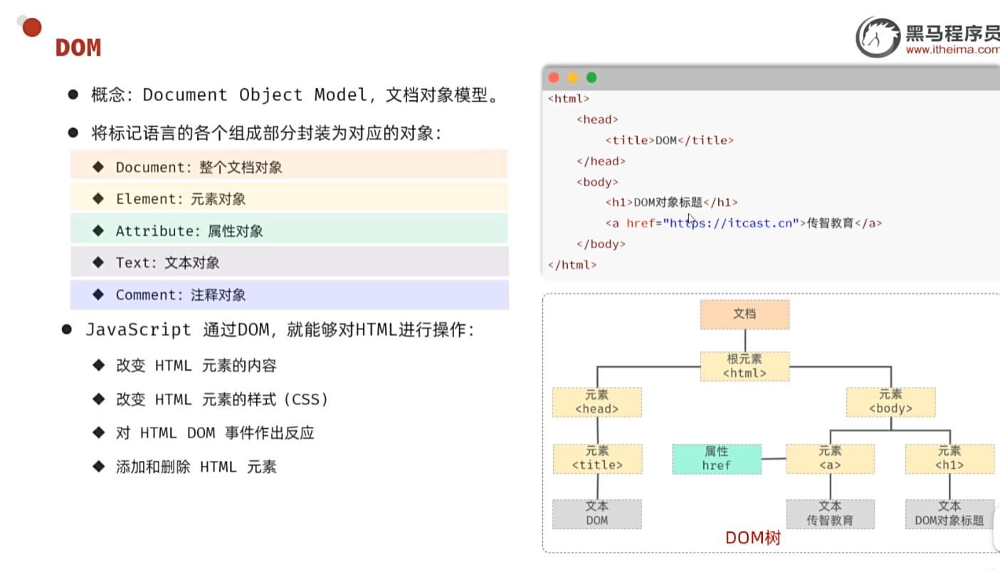

# JavaWeb JavaScript 笔记（一）

> 日期：2025-07-26

## 目录

- [JavaScript概述](#javascript概述)
- [JS引入方式](#js引入方式)
- [变量与数据类型](#变量与数据类型)
- [函数](#函数)
- [自定义对象](#自定义对象)
- [JSON](#json)
- [DOM操作](#dom操作)
- [事件监听](#事件监听)
- [模块化](#模块化)

---

## JavaScript概述

**JavaScript（简称：JS）** 是一门跨平台、面向对象的脚本语言，用来控制网页行为，实现页面的交互效果。JavaScript 和 Java 是完全不同的语言。

### JS组成

- **ECMAScript**：规定了JS基础语法核心知识，包括变量、数据类型、流程控制、函数、对象等
- **BOM**：浏览器对象模型，用于操作浏览器本身，如页面弹窗、地址栏操作、关闭窗口等
- **DOM**：文档对象模型，用于操作HTML文档，如改变标签内的内容、改变标签内字体样式等

---

## JS引入方式

### 内部脚本
将JS代码定义在HTML页面中，必须位于 `<script></script>` 标签之间。

### 外部引用
```html
<script src="./path/to/script.js"></script>
```

> 注意：JS每行的分号`;`可有可无

---

## 变量与数据类型

### 变量声明
- `let`：声明变量（推荐）
- `const`：声明常量，一旦声明，常量的值不能改变
- `var`：早期声明方式（不推荐）

```javascript
let a = 1;
a = 2;
const PI = 3.14;
// PI = 4; // 出错
a = 10;
a = 3.1;
a = "Hello world";
a = true;
console.log(a);
```

### 输出语句
- `window.alert()`：弹出警告框
- `console.log()`：写入浏览器控制台
- `document.write()`：向HTML的body内输出内容

### 数据类型
JavaScript的数据类型分为基本数据类型和引用数据类型（对象）。

**基本数据类型：**
- `number`：数字（整数、小数、NaN）
- `boolean`：布尔值（true, false）
- `null`：对象为空
- `undefined`：未初始化变量的默认值
- `string`：字符串，单引号、双引号、反引号皆可

```javascript
let a = true;
console.log(typeof a); // boolean
console.log(typeof null); // object
```

### 模板字符串
使用反引号和 `${}` 语法：

```html
<script>
  let name = 'Tom';
  let age = 18;
  console.log('大家好，我是新入职的' + name + '，今年' + age + '岁了，请多多关照');
  console.log(`大家好，我是新入职的${name}，今年${age}岁了，请多多关照`);
</script>
```

---

## 函数

函数是被设计用来执行特定任务的代码块，方便程序的封装复用。

### 普通函数
```javascript
function jie(a) {
    if(a == 1) return 1;
    else return jie(a-1) * a;
}

function add(a, b) {
    return a + b;
}
console.log(add(1, 2)); // 3
console.log(add(1, 2, 3)); // 3（第三个参数忽略）
```

### 匿名函数
```javascript
// 函数表达式
let add2 = function(a, b) {
    return a + b;
}

// 箭头函数
let addn = (a, b) => { return a + b; }
let add3 = (a, b) => a + b;
let func = a => a + 2;
let func2 = () => 3;
```

---

## 自定义对象

对象内部变量声明用逗号隔开：

```javascript
let user = {
    Name: "xiaoming",
    getname() { return this.Name },
    // getName: function(){return this.Name}, // 相同
    // 箭头函数的this不指向本对象，而是他的父级
    // getName: ()=>{return this.name}
    age: 18,
}
```

---

## JSON

**JSON**（JavaScript Object Notation）是JavaScript对象标记法，现多用于作为数据载体，在网络中进行数据传输。

### JS对象 vs JSON文本

**JS对象：**
```javascript
{
    name: "Tom",
    age: 20,
    gender: "男"
}
```

**JSON文本：**
```json
{
    "name": "Tom",
    "age": 20,
    "gender": "男"
}
```

### 转换方法
- `JSON.stringify(object)`：对象转字符串
- `JSON.parse(string)`：字符串转对象

```javascript
let user = {
    Name: "xiaoming",
    getname() { return this.Name },
    age: 18,
    gender: "Boy"
}
console.log(user.getname());
console.log(JSON.stringify(user)); // {"Name":"xiaoming","age":18,"gender":"Boy"}
console.log(JSON.parse(JSON.stringify(user)).Name); // xiaoming
```

---

## DOM操作



DOM操作核心思想：将网页中所有的元素当做对象来处理。

### 操作步骤
1. 获取要操作的DOM元素对象
2. 操作DOM对象的属性或方法

### 获取DOM对象
- `document.querySelector('选择器')`：获取匹配到的第一个元素
- `document.querySelectorAll('选择器')`：获取匹配到的所有元素（NodeList）

```html
<!DOCTYPE html>
<html lang="zh-cn">
<head>
    <meta charset="UTF-8">
    <meta name="viewport" content="width=device-width, initial-scale=1.0">
    <title>DOM操作示例</title>
</head>
<body>
    <h1 id="title1">111111</h1>
    <h1 id="title1">222222</h1>
    <h1 id="title1">333333</h1>
    <script>
        // querySelector只选择第一个
        let h1 = document.querySelector("#title1");
        h1.innerHTML = `FFFF`;
        
        let hs = document.querySelectorAll("#title1");
        // innerHTML可以访问也可以修改其中文字内容
        hs[0].innerHTML = 'FFF';
    </script>
</body>
</html>
```

---

## 事件监听

**语法：** `事件源.addEventListener('事件类型', 事件触发执行的函数)`

### 事件监听三要素
- **事件源**：哪个DOM元素触发了事件
- **事件类型**：用什么方式触发
- **事件触发执行的函数**：要做什么事

### 常见事件

| 事件类型 | 具体事件 |
| -------- | -------- |
| 鼠标事件 | click：鼠标点击<br>mouseenter：鼠标移入<br>mouseleave：鼠标移出 |
| 键盘事件 | keydown：键盘按下触发<br>keyup：键盘抬起触发 |
| 焦点事件 | focus：获得焦点触发<br>blur：失去焦点触发 |
| 表单事件 | input：输入内容<br>submit：表单提交 |

### 事件监听示例

```html
<!DOCTYPE html>
<html lang="zh-cn">
<head>
    <meta charset="UTF-8">
    <meta name="viewport" content="width=device-width, initial-scale=1.0">
    <title>Document</title>
    <style>
        table{
            border :1px solid black;
        }
        #table{
            width: 700px;
            height: 300px;
            margin: 100px auto;
            }
        #the_form{
            max-width:600px;
            margin : 30px auto;
        }
    </style>
</head>
<body>
    <form action = "" method="get">
    <div id = "the_form">
        USERNAME<input type = "text" id = "username">  
        <br>
        PASSWORD<input type = "password" id = "password">
        <br>
        <input type = "button" id = "but" value = "here"></input>
        <input type = "submit" id = "sub" value = "submit"></input>
    </div>
</form>
    <div id = "table">
    <table>
        <thead>
            <tr id = "data">
                <th>学号</th>
                <th>姓名</th>
                <th>年级</th>
                <th>班级</th>
            </tr>
        </thead>
        <tbody>
            <tr id = "data">
                <td>001</td>
                <td>张三</td>
                <td>一年级</td>
                <td>一班</td>
            </tr>
            <tr id = "data">
                <td>002</td>
                <td>李四</td>
                <td>二年级</td>
                <td>二班</td>
            </tr>
            <tr id = "data">
                <td>003</td>
                <td>王五</td>
                <td>三年级</td>
                <td>三班</td>
            </tr>
        </tbody>
    </table>
</div>
<script>
document.querySelectorAll("#data").forEach(item => {
    item.addEventListener("mouseenter", () => {
        item.style.backgroundColor = "yellow";
        console.log("鼠标进入");
    });
    item.addEventListener("mouseleave", () => {
        item.style.backgroundColor = "";
        console.log("鼠标离开");
    });
});

document.querySelector("#but").addEventListener("click", () => {
    console.log("click");
});

document.querySelector("#username").addEventListener("keydown", () => {
    console.log("键盘按下");
});

document.querySelector("#username").addEventListener("keyup", () => {
    console.log("键盘松开");
});

document.querySelector("#password").addEventListener("blur", () => {
    console.log("离焦");
});

document.querySelector("#password").addEventListener("focus", () => {
    console.log("聚焦");
});

document.querySelector("#username").addEventListener("input", () => {
    console.log("输入");
});

document.querySelector("form").addEventListener("submit", () => {
    window.alert("提交");
});
</script>
</body>
</html>
```

---

## 模块化

使用 `import` 和 `export` 进行模块化开发。

### utils.js
```javascript
export function printlog(msg) {
    console.log(msg);
}
```

### 另一个JS文件
```javascript
import {printlog} from "./utils.js";
```

### HTML文件
```html
<script src="../JS/eventdemo.js" type="module">
```

> 注意：需要在script标签中添加 `type="module"`